# 10장. dplyr로 하는 관계형 데이터

## 1. Introduction
1) 관계형 데이터란?  
   여러 데이터 테이블을 총칭한 것  
   데이터 분석 시, 데이터 테이블이 단 하나와만 관련된 경우는 없음  
   -> 개별 데이터셋보다 데이터셋의 관계가 중요함 

2) 관계는 항상 두 개의 테이블 사이에서 정의됨  
   **테이블 3개 이상인 관계**: 각 쌍 사이의 관계를 이용하여 정의  
   쌍을 이루는 두 요소가 같은 테이블이 될 수도 있음  

3) 관계형 데이터로 작업하기 위해 필요한 것?  
   두 개의 테이블에 작동하는 동사  
```
관계형 데이터에 동작하도록 설계된 3가지 계열 동사
- 뮤테이팅(mutating, 변형) 조인: 다른 데이터프레임의 관측값을 가져와 테이블의 새로운 변수로 추가
- 필터링 조인: 다른 테이블의 관측값과 일치하는지 여부로 관측값을 걸러냄
- 집합 연산: 관측값을 집합 원소로 취급
```  
4) 관계형 데이터가 있는 가장 기본 장소  
   관계형 데이터베이스 관리 시스템(RDBMS, Relational DataBase Management System)

5) 실습 준비
```{r}
library(tidyverse)
library(nycflights13) # 실습에서 사용할 테이블
```  

* **nycflights13 참고 사항**
2013년 뉴욕에서 출발한 336,776개 항공편 정보 (출처: 미 교통통계)
```
flights 테이블과 관련된 4개의 티블이 존재
: airlines, airports planes, weather
```  


## 2. nycflights13  
```{r}
nycflights13::flights %>%
   print(n = 6, width = Inf)
```

```{r}
airlines # 약어 코드로 전체 항공사명 조회됨
```
  
```{r}
nycflights13::airports %>% # 각 공항 정보가 faa 공항 코드로 식별됨
   print(n = 10, width = Inf)
``` 
  
```{r}
nycflights13::planes %>% # 각 여객기 정보가 tailnum으로 식별됨
   print(n = 10, width = Inf)
```
  
```{r}
nycflights13::weather %>% # 각 NYC 공항의 매 시각 날씨 정보
   print(n = 6, width = Inf)
```  

* **그림으로 정리**  
{width="400"}  
cf) airports와 weather 관계가 빠진 그림  

* **이해해야 할 관계**
```
- flights는 단 하나의 변수 tailum로 planes에 연결
- flights는 carrier 변수로 airlines에 연결
- flights는 origin(위치)과 dest(목적지) 변수로 airports에 연결
- flights는 origin, year, month, day, hour으로 weather에 연결
```

### + 연습문제
1. 각 여객기가 출발지에서 목적지까지 날아가는 경로를 그리려고 한다.  
   어떤 변수가 필요하고 어떤 테이블을 결합해야 하는가?

   -> 출발지 - 목적지 경로 확인 시, 필요한 변수: origin, dest, + 경로  
   결합해야 하는 테이블: flights(각 비행기의 origin & dest 속함) + airports(각 공항의 위도와 경도 값)

1st. 내부 조인 이용하여 테이블 결합하기
```{r}
flights_latlon <- flights %>% #flights_latlon 변수 생성
 inner_join(select(airports, origin = faa, origin_lat = lat, origin_lon = lon),
  by = "origin") %>% 
 inner_join(select(airports, dest = faa, dest_lat = lat, dest_lon = lon),
  by = "dest")

flights_latlon %>%
   print(n = 6, width = Inf)
```
origin과 dest가 faa 공항 코드로 정리(13, 14 columns)되었고  
origin_lat, origin_lon, dest_lat, dest_lon(20-23 columns)가 생겼다   

2nd. "maps" 패키지와 내부 조인 이용하여 지도 그리기  
install.packages("maps") # 필요한 패키지 설치&라이브러리
```{r}
library(maps)
library(tidyverse) #ggplot2, dplyr 함수 포함
```
  
```{r}
flights_latlon %>%
 slice(1:100) %>% # 행 번호로 행을 필터링 하는 함수
 ggplot(aes(x = origin_lon, xend = dest_lon,
            y = origin_lat, yend = dest_lat)) +
 borders("state") + geom_segment(arrow = arrow(length = unit(0.1, "cm"))) + 
 coord_quickmap() + 
 labs(y = "Latitude", x = "Longitude")
```

2. weather과 airports 사이의 관계는 어떠한가?  
   다이어그램도 그려보아라. 
   
   airports$faa는 weather$origin의 외래키이다.  
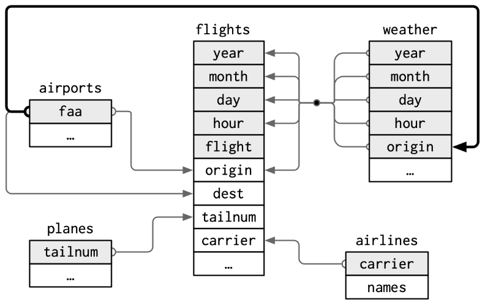{width="400"} 

3. weather는 출발지 NYC 공항 정보만 포함한다.  
   미국 모든 공항의 날씨 기록이 포함되어 있다면 flights와 어떤 관계가 추가되는가?
   
   만약 US의 전체 공항 날씨가 포함된다면, 각 비행기의 목적지 날씨를 제공할 수 있다.  
   weather 변수의 year, month, day, hour, origin은 flightS 변수 year, month day, hour, dest의 외래키가 된다.  
   weather 변수는 목적지 공항에 비행기가 도착했을 때, 날씨 정보를 알려줄 수 있다.

4. 1년 중 어떤 날이 '특별한' 것과 특별한 날에는 항공여행객이 평소보다 적다.  
   데이터프레임으로 어떻게 표현하는가? 테이블의 기본키는 무엇이며 기존 테이블에 어떻게 연결되는가?
  
```{r}
special_days <- tribble(~year, ~month, ~day, ~holiday,
                        2013, 01, 01, "New Years Day",
                        2013, 07, 04, "Independence Day",
                        2013, 11, 29, "Thanksgiving Day",
                        2013, 12, 25, "Christmas Day")

special_days
```
cf) special_days의 기본키는 year, month, day, holiday

  
## 3. KEY
키(KEY)란 무엇인가?  
: 각 테이블 쌍을 연결할 때 사용되는 변수, 관측값을 고유하게 식별하는 변수(or 변수 집합)  
ex) nycflights13에서 각 여객기는 tailnum으로 고유하게 식별됨  
weather는 year, month, day, hour, origin 다섯 변수로 식별됨  

```
키(KEY)
- 기본키(primary key)
자신의 테이블에서 관측값을 고유하게 식별
ex) planes$tailnum은 planes테이블의 각 여객기를 고유하게 식별하므로 기본키

- 외래키(foreign key)
다른 테이블의 관측값을 고유하게 식별
ex) flight$tailnum은 flights 테이블에서 각 항공편을 고유한 여객기와 매칭시키므로 외래키

+ 한 변수가 기본키이며 동시에 외래키일 수 있음
ex) 출발지는 weather 기본키의 일부이며 airport 테이블의 외래키이기도 함
```  
테이블에서 기본키를 확인한 후에는 기본키가 실제로 각 관측값을 고유하게 식별하는지 확인해야 함   
-> 기본키를 count()하고 n이 1보다 큰 항목 찾기: 항목이 없으면 기본키가 됨
```{r}
planes %>%
   count(tailnum) %>%
   filter(n > 1)
```
```{r}
weather %>%
   count(year, month, day, hour, origin) %>%
   filter(n > 1)
```
  
+ 추가
테이블에 명시적인 기본키가 없는 경우도 있음  
: 모든 행은 관측값이지만 어떤 변수를 조합해도 각 행을 신뢰성 있게 구분하지 못하는 경우  
ex) flight 테이블의 기본키는? 없다
```{r}
flights %>%
   count(year, month, day, flight) %>%
   filter(n > 1)
```
```{r}
flights %>%
   count(year, month, day, tailnum) %>%
   filter(n > 1)
```  
  
+ 대체키(surrogate key)  
  : 테이블에 기본키가 없는 경우, mutate()와 row_number()로 기본키 추가  
  
+ 기본키와 외래키의 관계  
대개 일대다(one-to-many) 관계: 각 항공편에는 여객기 하나, 각 여객기에는 여러 항공편  
다대다(many-to-many): 다대일 관계와 일대다 관계를 사용하여 다대다 관계 모델링이 가능  
ex) airline과 airport 간에 다대다 관계가 성립 (각 항공사는 많은 공항으로 운행, 각 공항에는 많은 항공사 존재)    
추가로, 일대일(1-to-1), 다대일(many-to-1) 관계도 있음

  
### + 연습문제  
1. flights에 대체키를 추가하라.  
```{r}
flights %>%
   arrange(year, month, day, sched_dep_time, carrier, flight) %>%
   mutate(flight_surrogate = row_number()) %>%
   glimpse()
```
  
2. 다음 데이터셋의 키를 식별하라.  
   a. Lahman::Batting  
install.packages("Lahman")
library(Lahman)  
str(Batting)
```{r}
Lahman::Batting %>%
   count(playerID, yearID, stint) %>%
   filter(n > 1) %>%
   nrow()
```  

   b. babynames::babynames  
install.packages("babynames")
library(babynames)  
str(babynames)  
```{r}
babynames::babynames %>%
   count(year, sex, name) %>%
   filter(n > 1) %>%
   nrow()
```

   c. nasaweather::atmos  
install.packages("nasaweather")
library(nasaweather)  
str(atmos)  
```{r}
nasaweather::atmos %>%
   count(lat, long, year, month) %>%
   filter(n > 1) %>%
   nrow()
```

   d. fueleconomy::vehicles  
install.packages("fueleconomy")
library(fueleconomy)  
str(vehicles)
```{r}
fueleconomy::vehicles %>%
   count(id) %>%
   filter(n > 1) %>%
   nrow()
```

   e. ggplot2::diamonds  
str(diamonds)  
```{r}
ggplot2::diamonds %>%
   distinct() %>% # 중복 없는 row 추출 함수
   nrow()
```
-> 기본키가 존재하지 않는다. 대체키(surrogate key) 추가하여야 식별 가능하다.
```{r}
diamonds <- mutate(ggplot2::diamonds, diamonds_surrogate = row_number())

str(diamonds)

#대체키 추가된 상태로 키 식별하기
diamonds %>%
   count(carat, cut, diamonds_surrogate) %>%
   filter(n > 1) %>%
   nrow()
```
대체키를 추가하고 조회하니, 키 식별이 가능해졌다.   

3. Lahman 패키지의 Batting, Master, Salaries 테이블 간의 연결을 나타내는 다이어그램을 그려라.  
Master, Managers, AwardsManagers 사이 관계를 보여주는 또 다른 다이어그램을 그려라.  
Batting, Pitching, Fielding 테이블 간의 관계를 어떻게 규정하겠는가?  


## 4. 뮤테이팅 조인
뮤테이팅 조인(mutating join): 한 쌍의 테이블을 결합하기 위해 살펴볼 도구  
뮤테이팅 조인을 사용하면 두 테이블의 변수를 결합할 수 있음  
관측값을 키로 매칭시킨 뒤, 한 테이블에서 다른 테이블로 변수를 복사   
변수를 오른쪽에 추가하므로 이미 많은 변수가 있는 경우 새 변수가 출력되지 않음  
```{r}
flights2 <- flights %>%
   select(year:day, hour, origin, dest, tailnum, carrier)
flights2
```  

가정) flight2 데이터에 항공사 전체 이름을 추가
      -> left_join()으로 airlines와 flights2 데이터프레임 결합 가능
```{r}
flights2 %>%
   select(-origin, -dest) %>%
   left_join(airlines, by = "carrier")
```
-> flights2는 airlines와 결합하여 새 변수 name이 추가됨


### 4-1. 조인 이해하기
조인 작동법 배우기  
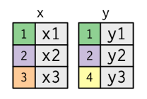{width="200"} 

```{r}
x <- tribble(~key, ~val_x,
             1, "x1",
             2, "x2",
             3, "x3")
y <- tribble(~key, ~val_y,
             1, "y1",
             2, "y2",
             4, "y3")

x
y
```
왼쪽 열은 '키' 변수를 나타내며 테이블 사이 행을 일치시키는 데 사용  
오른쪽 열은 따라가는 '값' 열을 나타냄

조인이란?
x의 각 행을 y의 0, 1개 또는 여러 행에 연결하는 방법  
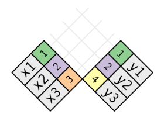{width="200"}  

실제 조인에서는 매치 항목이 점으로 표시됨  
(점 수 = 매치 수 = 출력 행 수)  
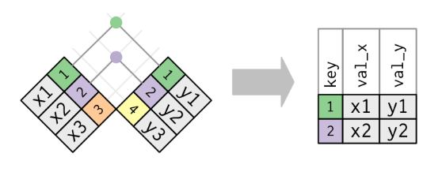{width="400"}

### 4-2. 내부 조인
inner join: 키가 같을 때마다 두 관측값을 매칭함  
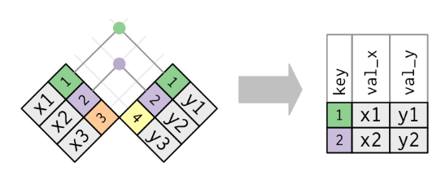{width="400"}

내부 조인 출력은 키, x 값과 y 값을 포함하는 새로운 데이터 프레임  
by를 사용하여 어떤 변수가 키인지 결정  

* **내부 조인의 가장 중요한 특성**  
  매칭되지 않는 행은 결과에 포함되지 않음  
  -> 관측값을 잃기 쉬워서 일반적인 분석 시, 적합하지 않음

### 4-3. 외부 조인  
내부 조인에서는 두 테이블에 나타나는 관측값이 모두 보존  
외부 조인에서는 적어도 하나의 테이블에 있는 관측값 보존

```
외부 조인의 3가지 유형
- 왼쪽 조인(left join)은 x의 모든 관측값을 보존
- 오른쪽 조인(right join)은 y의 모든 관측값을 보존
- 전체 조인(full join)은 x와 y의 모든 관측값을 보존
```

각 테이블에 '가상' 관측값을 추가하여 작동하는데,  
이 관측값에는 항상 매칭되는 키(다른 키 매칭 안 되는 경우)와 NA로 채워진 값이 있음

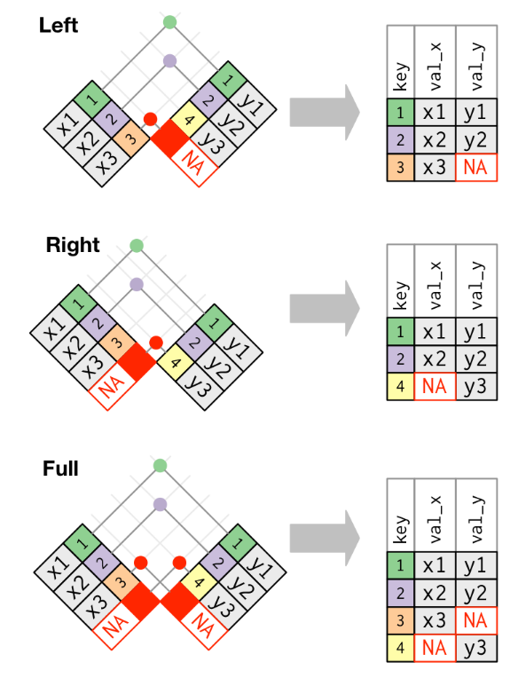{width="400"}  

벤 다이어그램으로 서로 다른 유형의 조인 묘사하기  
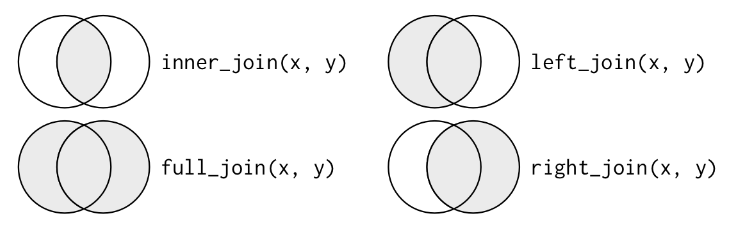{width="400"}   
cf) 벤 다이어그램은 키가 고유하게 관측값을 식별하지 못할 때, 발생하는 문제를 표현하지 못함  

### 4-4. 중복키  
현재까지 모든 테이블 키가 고유하다고 가정하였으나, 키가 고유하지 않은 2가지 경우 살펴보기

- 하나의 테이블에 중복키가 있는 경우  
  : 중복키는 추가 정보를 넣을 때 유용한데 일반적으로 일대다 관계가 있기 때문  
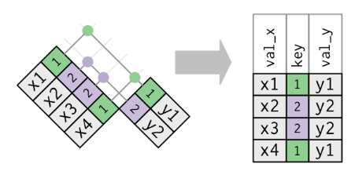{width="400"} 
```{r}
x <- tribble(
   ~key, ~val_x,
   1, "x1",
   2, "x2",
   2, "x3",
   1, "x4")
y <- tribble(
   ~key, ~val_y,
   1, "y1",
   2, "y2")
left_join(x, y, by = "key")
```

- 두 테이블 모두 중복키가 있는 경우  
  : 키가 어느 테이블에서도 고유하게 관측값을 식별하지 않음 -> 일반적 오류  
  : 중복키로 조인하면 가능한 모든 조합인 데카르트곱(Cartesian product)을 얻을 수 있음  
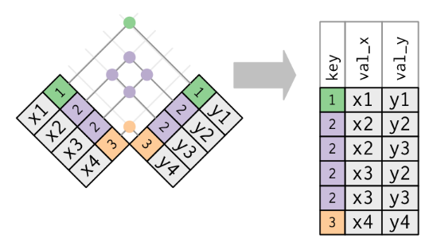{width="400"}  
```{r}
y <- tribble(
   ~key, ~val_y,
   1, "y1",
   2, "y2",
   2, "y3",
   1, "y4")
left_join(x, y, by = "key")
```  

### 4-5. 키 열 정의하기
현재까지 테이블 쌍은 항상 하나의 변수로 조인되었으며,  
그 변수는 두 테이블에서 같은 이름을 가짐    
(by = "key"로 제약사항 코드화함)

by에 다른 값을 사용하여 테이블을 연결하는 방법 살펴보기

- 기본값 by = NULL 사용  
  두 테이블에 있는 모든 변수를 사용하는 자연 조인(nature join)  
```{r}
flights2 %>%
   left_join(weather) %>%
   print(n = 6, width = Inf)
```

- 문자형 벡터 by = "x" 사용하기  
  자연 조인과 같지만 일부 공통 변수만 사용  
  ex) flights와 planes에는 year 변수가 있지만 서로 다른 의미라 tailnum만 조인하고 싶은 경우  
```{r}
flights2 %>%
   left_join(planes, by = "tailnum") %>%
   print(n = 6, width = Inf)
```
cf) year 변수에 접미사가 붙어서 출력 시 헷갈리지 않게 나옴

- 이름 있는 문자 벡터, by = c("a" = "b") 사용  
  테이블 x의 변수 a와 테이블 y의 변수 b를 매칭 -> x 변수가 출력에 사용됨  
  ex) 지도 그릴 때, flights 데이터를 각 공항 위치(lat, lon)가 포함된 airports 데이터와 결합해야 함, 각 항공편에는 출발 공항와 도착 공항이 있으므로 어떤 것에 조인할지 지정해야 함  

### + 연습문제
1. 목적지별 평균 지연 시간을 계산한 뒤, airports 데이터프레임에 조인하여 지연의 공간 분포를 표시하라. 다음을 이용해 미국 지도를 쉽게 그릴 수 있다.  
```{r}
airports %>%
   semi_join(flights, c("faa" = "dest")) %>%
   ggplot(aes(lon, lat)) +
     borders("state") + 
     geom_point() +
     coord_quickmap()
```  

```{r}
avg_dest_delays <- flights %>%
   group_by(dest) %>%
   summarise(delay = mean(arr_delay, na.rm = TRUE), .groups = 'drop') %>%
   inner_join(airports, by = c(dest = "faa"))

avg_dest_delays %>%
   print(n = 6, width = Inf)

avg_dest_delays %>%
   ggplot(aes(lon, lat, color = delay)) +
   borders("state") + 
   geom_point() +
   coord_quickmap()
```

2. flights에 출발지와 목적지의 위치(즉, lat과 lon)를 추가하라.  
```{r}
airport_locations <- airports %>%
   select(faa, lat, lon)

flights_locations <- flights %>%
   select(year:day, hour, origin, dest) %>%
   left_join(airport_locations, by = c("origin" = "faa")) %>%
   left_join(airport_locations, by = c("dest" = "faa"))

flights_locations %>%
   print(n = 6, width = Inf)
```

3. 여객기의 나이와 지연 시간 사이에 관계가 있는가?


4. 어떤 기상 조건이 지연 가능성을 더 높이는가?


5. 2013년 6월 13일에 무슨 일이 일어났는가? 지연의 공간 패턴을 표시한 후, 구글을 사용하여 날씨와 상호참조하라.


### + 기타 구현  
base::merge()는 4가지 유형의 뮤테이팅 조인을 수행할 수 있음  
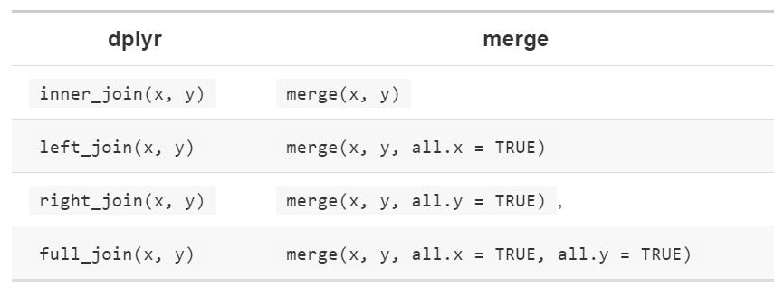{width="400"}  

특정 dplyr 동사 장점은 코드 의도를 더 명확하게 전달하는 것
-> 조인 간의 차이는 중요하지만 merge() 인수에 있음, dplyr 조인은 상당히 빠르고 행 순서를 어지럽히지 않음

dplyr 규칙은 SQL에 기반하여 서로 옮겨쓰기 쉬움  
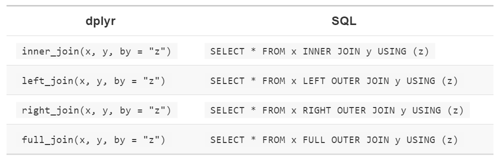{width="400"}  
  
inner 및 outer는 선택사항으로 종종 생략됨  

inner_join(x, y, by = c("a" = "b))처럼 테이블간 다른 변수를 결합할 때, SQL에서 약간 다르게 표현  
SQL은 dplyr보다 넓은 조인 유형을 지원하며 등식이 아닌 다른 제약 조건으로도 테이블 연결이 가능(비동등 조인, non-equisjoin)  


## 5. 필터링 조인  
필터링 조인은 뮤테이팅 조인과 같은 방식으로 관측값을 매칭함  
단, 변수가 아닌 관측값에 영향을 줌  
```
- semi_join(x, y)는 y와 매치되는 x의 모든 관측값을 보존함
- anti_join(x, y)는 y와 매치되는 x의 모든 관측값을 삭제함
```  
semi_join은 필터링된 요약 테이블을 다시 원래 행과 매치시킬 때 유용  
ex) 가장 인기 있는 상위 10개 도착지를 구했다고 가정  
```{r}
top_dest <- flights %>%
   count(dest, sort = TRUE) %>%
   head(10)
top_dest
```  

목적지 중 한 곳으로 운행한 항공편을 찾는 방법: 필터 만들기  
```{r}
flights %>%
   filter(dest %in% top_dest$dest) %>%
   print(n = 6, width = Inf)
```  
그러나, 이러한 접근 방식을 여러 변수로 확장하기는 어려움  
  
* semi_join을 사용하는 방법  
단, 새 열을 추가하는 대신 y에서 일치하는 x의 행만 보존
```{r}
flights %>%
   semi_join(top_dest) %>%
   print(n = 6, width = Inf)
```  
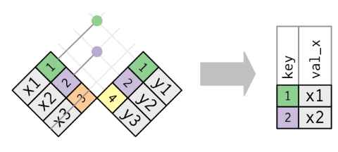{width="400"}  
  
매칭 여부만이 중요할 뿐, 어떤 관측값이 매칭되는지는 중요하지 않음  
-> 뮤테이팅 조인처럼 행을 복제하지는 않음을 의미  
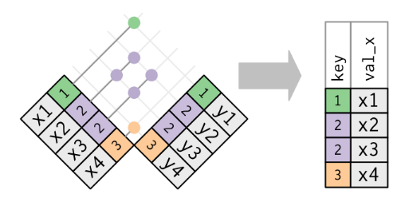{width="400"}  
  
anti_join은 semi_join의 반대이며, 매칭되지 않는 행을 보존함  
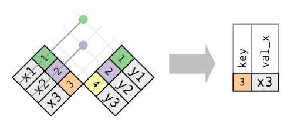{width="400"}   
anti_join은 조인 불일치를 진단할 때 유용함  
ex) 항공편과 여객기를 연결하는 경우, 여객기에 매칭되지 않는 항공편이 많음을 알고 싶을 수 있음  
```{r}
flights %>%
   anti_join(planes, by = "tailnum") %>%
   count(tailnum, sort = TRUE)
```

### + 연습문제  
1. 공편에 tailnum이 없는 것은 무엇을 의미하는가?  
planes에 매치되는 관측값이 없는 tailnum 관측값들의 공통점은 무엇인가?  
hint: 한 변수가 문제의 약 90%를 설명  
-> tailnum이 없다는 것은 비행기가 취소되었다는 것: arr_time도 없음  
```{r}
flights %>%
   filter(is.na(tailnum), !is.na(arr_time)) %>%
   nrow()
```

?planes  
"American Airways (AA) and Envoy Air (MQ) report fleet numbers rather than tail numbers so can't be matched."  
```{r}
flights %>%
   anti_join(planes, by = "tailnum") %>%
   count(carrier, sort = TRUE) %>%
   mutate(p = n / sum(n))
```

그러나, 모든 flights의 tail numbers가 planes 테이블에서 사라진 것은 아니다.   불일치를 조정하여야 한다.  
```{r}
flights %>%
  distinct(carrier, tailnum) %>%
  left_join(planes, by = "tailnum") %>%
  group_by(carrier) %>%
  summarise(total_planes = n(),
            not_in_planes = sum(is.na(model))) %>%
  mutate(missing_pct = not_in_planes / total_planes) %>%
  arrange(desc(missing_pct))
```  

2. filghts를 필터링하여 최소 100편을 운행한 여객기의 항공편만 표시하라.  

1st. 최소 100번 운행한 비행기 중, 유효한 비행기 모두 찾기  
```{r}
planes_100flights <- flights %>%
   filter(!is.na(tailnum)) %>%
   group_by(tailnum) %>%
   count() %>%
   filter(n >= 100)

planes_100flights
```  
  
2nd. semi_join을 이용해서 원래 행과 매칭시키기  
```{r}
flights %>%
  semi_join(planes_100flights, by = "tailnum")
```  
  
3. fueleconomy::vehicles와 fueleconomy::common을 조인하여 가장 많은 차량 모델의 레코드만 찾아라.  
```{r}
fueleconomy::vehicles %>%
  semi_join(fueleconomy::common, by = c("make", "model")) %>% #make 사용 이유: 같은 모델명이 있을 수 있으므로
   print(n = 6, width = Inf)
```
```{r}
fueleconomy::vehicles %>%
  distinct(model, make) %>%
  group_by(model) %>%
  filter(n() > 1) %>%
  arrange(model)

fueleconomy::common %>%
  distinct(model, make) %>%
  group_by(model) %>%
  filter(n() > 1) %>%
  arrange(model)
```  

4. 1년 중 가장 지연된 48시간을 찾아, 날씨 데이터와 교차 참조하라.  
어떤 패턴을 볼 수 있는가?  


5. anti_join(flights, airports, by = c("dest" = "faa"))를 보고 무엇을 알 수 있는가?  
anti_join(airports, flights, by - c("faa" = "dest"))는 어떤가?  


6. 각 항공기는 단일 항공사가 운항하므로 항공기와 항공사 간 암묵적인 관계를 예상할 수 있다. 이전 절에서 배운 도구로 가설을 확인하거나 기각하라.  


## 6. 조인 문제  
현재 공부한 데이터는 정제된 데이터로 문제가 발생하지 않았으나, 실제로 작업할 데이터는 문제가 많을 수 있음  


* 데이터 확인 시, 수행할 것  
1) 기본키를 구성하는 변수 식별하기  
   : 고유한 식별자가 되는 변수 조합을 찾아야 함  
```{r}
airports %>% count(alt, lon) %>% filter(n > 1)

```

2) 기본키 변수에 결측값이 없는지 확인하기  
   : 값이 결측된 경우에는 관측값을 식별할 수 없음  

3) 외래키가 다른 테이블의 기본키와 매칭되는지 확인하기  
   : anti_join을 사용하는 것이 가장 좋은 방법  

  
## 7. 집합 연산  
복잡한 필터를 단순한 필터를로 분해하려는 경우에 종종 사용  
행 전체에 동작하면서 모든 변수의 값을 비교함  
x와 y 입력이 같은 변수를 가진다고 간주하며 관측값을 집합으로 취급  

```
- intersect(x, y): x, y 모두에 있는 관측값만 반환
- union(x, y): x와 y의 고유한 관측값을 반환
- setdiff(x, y):x에 있지만, y에는 없는 관측값을 반환
```
   
ex) 간단한 데이터로 살펴보기  
```{r}
df1 <- tribble(
   ~x, ~y,
   1, 1,
   2, 1)
df2 <- tribble(
   ~x, ~y,
   1, 1,
   1, 2)

intersect(df1, df2) #행이 3개로 나옴!
union(df1, df2)
setdiff(df1, df2)
```
  
- dplyr로 하는 관계형 데이터 끝