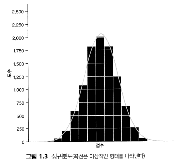

```{r setup, include=FALSE}
knitr::opts_chunk$set(echo = TRUE)

library(car)
library(ggplot2)
library(pastecs)
library(psych)
```

# ch05 자료에 관한 가정

## 5.1 이번 장에서 배우는 내용①

우리가 가진 자료가 너무 크고, 필요한 정보가 전혀 들어 있지 않은 것처럼 보이는지 평가하고, 그것을 아름다운 자료로 바꾸는 방법을 살펴본다.

## 5.3 모수적 자료의 가정들 ①

정규분포에 기초한 모수적 검정이란 통계학자들이 밝혀낸 분포 중 하나를 따르는 자료를 요구하는 검정. 그 자료는 반드시 특정한 가정들을 만족하는 파라미터적 자료여야 한다.<br>

<b>정규분포</b>: 이상적인 세상이라면 자료가 모든 점수의 중심을 기준으로 좌우 대칭 형태일 것이다. 만일 분포의 중심에 수직선을 그린다면 그 양쪽이 거울처럼 같은 모습이 될 텐데, 그런 형태의 분포를 정규분포라고 부른다.



어떤 통계적 판정이 적합한지 결정하려면 먼저 관련 가정들부터 확인하는 것이 아주 중요하다.

<b>모수적 검정의 4가지 기본 가정</b><br>

1. 분포의 정규성: 가설 검정에 깔린 논리는 뭔가가 정규분포를 따른다는 점에 의존한다. 따라서 이 가정이 위반되면 가설 검정에 깔린 논리에 결함이 생긴다.

2. 분산의 동질성: 자료 전반에서 분산들이 동일하다는 뜻이다. 한 변수의 분산이 다른 변수의 모든 수준에서 안정적이라는 뜻이다.

3. 구간 자료: 자료가 적어도 구간 수준에서 측정한 것이어야 한다.

4. 독립성: 한 참가자의 행동이 다른 참가자의 행동에 영향을 미치지 않아야 한다는, 독립적이어야 한다는 뜻이다.<br>

이번 장은 자료의 정규분포성, 줄여서 정규성 가정과 분산의 동질성 가정에 초점을 둔다.

## 5.4 이번 장에서 사용하는 R 패키지①

```r
install.packages(c('car', 'ggplot2', 'pastecs', 'psych'))

library(car)
library(ggplot2)
library(pastecs)
library(psych)
```


