 
```{r setup, include=FALSE}
knitr::opts_chunk$set(echo = TRUE)
```
   
# 5.5 정규성 가정

여러 통계적 검정에서는 표집분포가 정규분포라고 가정한다. 그러나 우리가 그 분포에 접근할 수 없다는 점이 문제이다. 즉, 표집분포가 어떤 형태이고 정규분포와 부합하는지 직접 확인하는 것이 불가능하다. 그러나 중심극한정리에 의하면, 표본 자료가 대략정규분포이면 표집분포도 정규분포러고 간주할 수 있다. 그래서 사람들은 표본 자료가 정규분포인지 확인함으로써 이 가정을 확인하려 한다.

정규성 가정은 회귀를 사용하는 연구에서도 중요하다. 일반선형모형은 모형의 오차들이 정규분포를 따른다고 가정한다.

## 5.5.1 눈으로 정규성 확인하기

도수분포는 분포의 형태를 살펴보는데 유용한 수단이다. 앞장의 예를 들어보면 한 생물학자가 3일간 다운로드 페스티벌 관객들의 위생 상태를 표준화된 기법으로 측정했다. 위생 상태의 최하점은 0이고 최고점은 4이다. 

library(ggplot2)

library(pastecs)

library(psych)

library(dplyr)

library(Rcmdr)

```
dlf <- read.delim("DownloadFestival(No outlier).dat", header=TRUE)

glimpse(dlf)
#> Rows: 810
#> Columns: 5
#> $ ticknumb <int> 2111, 2229, 2338, 2384, 2401, 2405, 2467, 2478, 2490, 2504, 2509, 2510, 2514, 2515, 25...
#> $ gender   <chr> "Male", "Female", "Male", "Female", "Female", "Male", "Female", "Female", "Male", "Fem...
#> $ day1     <dbl> 2.64, 0.97, 0.84, 3.03, 0.88, 0.85, 1.56, 3.02, 2.29, 1.11, 2.17, 0.82, 1.41, 1.76, 1....
#> $ day2     <dbl> 1.35, 1.41, NA, NA, 0.08, NA, NA, NA, NA, 0.44, NA, 0.20, NA, 1.64, 0.02, NA, NA, 2.05...
#> $ day3     <dbl> 1.61, 0.29, NA, NA, NA, NA, NA, NA, NA, 0.55, NA, 0.47, NA, 1.58, NA, NA, NA, NA, NA, ...
```
 # Error in file(file, "rt") : 커넥션을 열 수 없습니다.

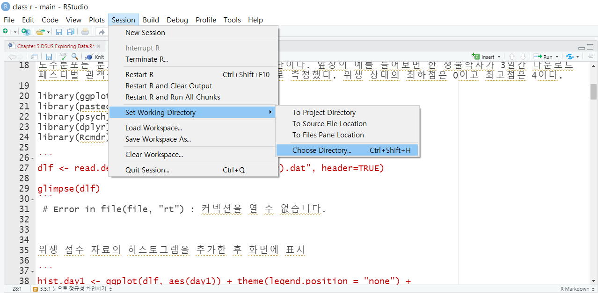

위생 점수 자료의 히스토그램을 추가한 후 화면에 표시

```
hist.day1 <- ggplot(dlf, aes(day1)) + theme(legend.position = "none") + geom_histogram(aes(y=..density..), colour="black", fill="white") + labs(x="Hygiene score on day 1", y = "Density") 

hist.day2 <- ggplot(dlf, aes(day2)) + theme(legend.position = "none") + geom_histogram(aes(y=..density..), colour="black", fill="white") + labs(x="Hygiene score on day 2", y = "Density")

hist.day3 <- ggplot(dlf, aes(day3)) + theme(legend.position = "none") + geom_histogram(aes(y=..density..), colour="black", fill="white") + labs(x="Hygiene score on day 3", y = "Density")
# 기존의 opts함수는 ggplot2로 넘어 오면서 theme로 대체 사용됨
```
```
hist.day1
hist.day2
hist.day3
```
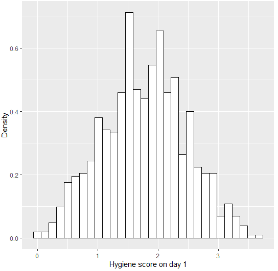, 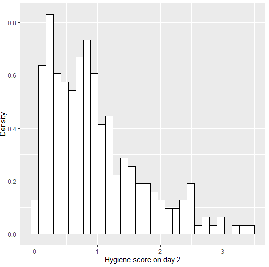, 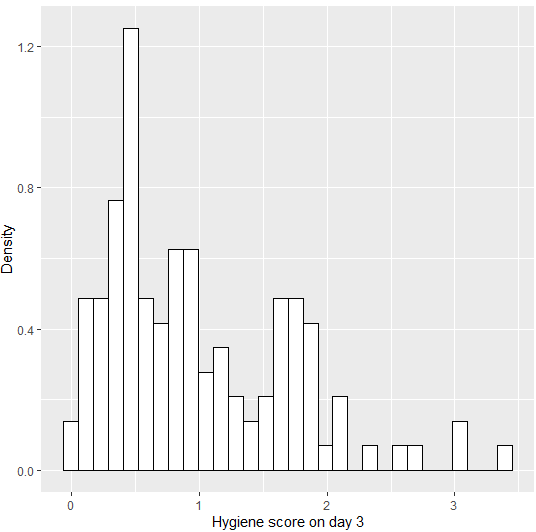

그래프를 만드는 명령을 부분별로 살펴보자.

- ggplor(dlf, aes(day1)): R에게 dlf 데이터프레임의 day1 변수를 그리라고 알려준다.

- theme(legend.position = "none"): 그래프의 범례를 표시하지 않게 한다.

- geom_histogram(aes(y=..density..), colour="black", fill="white"): 선을 검은색으로 그리고 막대 내부를 흰색으로 채우게 한다. aes(y=..density..)는 밀도 그림을 그리라는 뜻, 정규분포를 곡선으로 표시하기 위한 것이다.

- labs(x="Hygiene score on day 1", y = "Density"): x,y의 이름을 설정한다.

그래프에 정규분포 곡선을 표시하는 코드를 추가할 것이다. 비교를 위한 평균과 표준편차를 지정해야 한다. 이전의 그래프 객체에 정규 곡선을 표시하는 명령어를 추가한다. 

```
hist.day1 + stat_function(fun = dnorm, args = list(mean = mean(dlf$day1, na.rm = TRUE), sd = sd(dlf$day1, na.rm = TRUE)), colour = "black", size = 1)

hist.day2 + stat_function(fun = dnorm, args = list(mean = mean(dlf$day2, na.rm = TRUE), sd = sd(dlf$day2, na.rm = TRUE)), colour = "black", size = 1)

hist.day3 + stat_function(fun = dnorm, args = list(mean = mean(dlf$day3, na.rm = TRUE), sd = sd(dlf$day3, na.rm = TRUE)), colour = "black", size = 1)

```
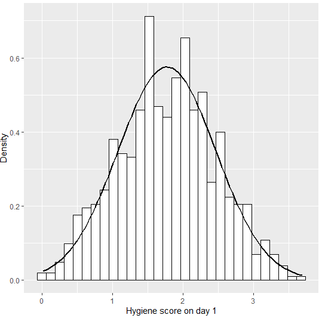, 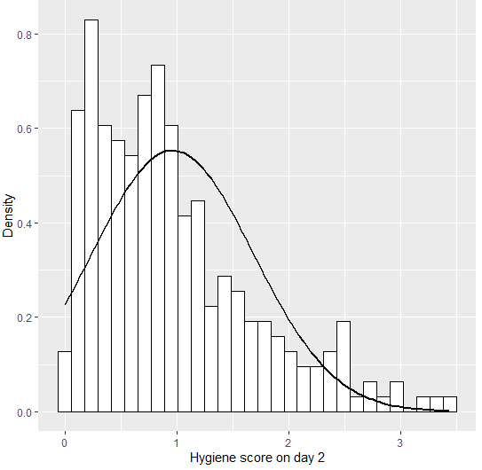, 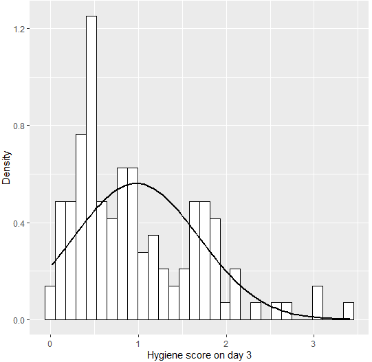

그래프를 만드는 명령을 부분별로 살펴보자.

- stat_function(): dnorm() 함수를 이용해서 정규 곡선을 그린다. 평균과 표준편차의 정규분포에서 주어진 값에 해당하는 확률(밀도)을 돌려준다.

- mean = mean(dlf$day1, na.rm = TRUE): 정규분포의 평균에 결측값을 모두 제거한 후의 day1 변수를 편균으로 설정한다.

- sd = sd(dlf$day1, na.rm = TRUE): 정규분포의 표준편차를 day1 변수의 표준편차로 설정한다.

분포가 정규인지 조사할 때는 **Q-Q그림**(분위수-분위수 그림)이라고 하는 그래프도 유용하다. 자료의 누적값들을 특정 분포의 누적 확률과 대조해서 표시한다.
 # 분위수: 전체 중 특정 값 미만의 자료들이 차지하는 비율

```
qqplot.day1 <- qplot(sample = dlf$day1, stat="qq")

qqplot.day2 <- qplot(sample = dlf$day2, stat="qq")

qqplot.day3 <- qplot(sample = dlf$day3, stat="qq")
```
```
qqplot.day1
qqplot.day2
qqplot.day3
```
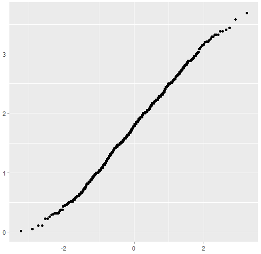, 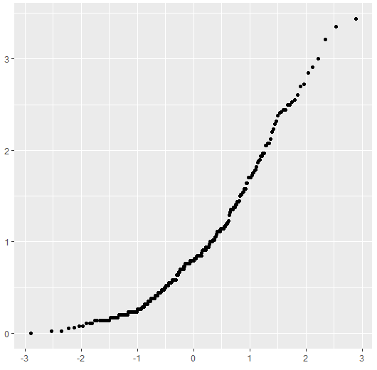, 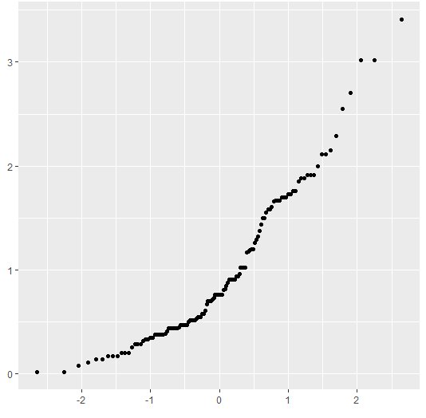

이틀간의 히스토그램에 해당하는 Q-Q 그림이 나왔다. 첫째 날의 자료가 이상적으로 보인다. 히스토 그램을 보면 분포가 정규 분포에 가깝다. 분포가 대칭이고, 너무 뾰족하지도 평평하지 않은데 바람직한 모형이다.

 # 히스토그램: 막대그래프
 # 정규분포: 좌우대칭

## 5.5.2 정규성의 수량화

히스토그램을 보면 도움이 되지만 주관적이고 오남용의 여지가 있다. 이번에는 분포의 형태를 수량화하는 방법과 그에 기초해서 이상치들을 찾는 방법을 살펴보자.

library(psych)

library(pastecs)


**단일 변수에 대한 함수 **
```
describe(dlf$day1) #library(psych)실행
#>   vars   n mean   sd median trimmed mad  min  max range skew kurtosis   se
#> X1    1 810 1.77 0.69   1.79    1.77 0.7 0.02 3.69  3.67    0    -0.42 0.02

stat.desc(dlf$day1, basic = FALSE, norm = TRUE) #library(pastecs)실행
#>      median         mean      SE.mean CI.mean.0.95          var      std.dev     coef.var 
#>  1.79000000   1.77113580   0.02436847   0.04783289   0.48099624   0.69353892   0.39157862 
#>    skewness     skew.2SE     kurtosis     kurt.2SE   normtest.W   normtest.p 
#> -0.00442835  -0.02577395  -0.42159405  -1.22838457   0.99591522   0.03198482 
```
- 가장 간단한 방식, 
- basic: 기초통계량을 추출, norm: 정규분포 자료를 추출

**여러 변수에 대한 함수**
```
describe(cbind(dlf$day1, dlf$day2, dlf$day3))
#>    vars   n mean   sd median trimmed  mad  min  max range skew kurtosis   se
#> X1    1 810 1.77 0.69   1.79    1.77 0.70 0.02 3.69  3.67 0.00    -0.42 0.02
#> X2    2 264 0.96 0.72   0.79    0.87 0.61 0.00 3.44  3.44 1.08     0.76 0.04
#> X3    3 123 0.98 0.71   0.76    0.90 0.61 0.02 3.41  3.39 1.01     0.59 0.06

stat.desc(cbind(dlf$day1, dlf$day2, dlf$day3), basic = FALSE, norm = TRUE)
#>                       V1           V2           V3
#> median        1.79000000 7.900000e-01 7.600000e-01
#> mean          1.77113580 9.609091e-01 9.765041e-01
#> SE.mean       0.02436847 4.436095e-02 6.404352e-02
#> CI.mean.0.95  0.04783289 8.734781e-02 1.267805e-01
#> var           0.48099624 5.195239e-01 5.044934e-01
#> std.dev       0.69353892 7.207801e-01 7.102770e-01
#> coef.var      0.39157862 7.501022e-01 7.273672e-01
#> skewness     -0.00442835 1.082811e+00 1.007813e+00
#> skew.2SE     -0.02577395 3.611574e+00 2.309035e+00
#> kurtosis     -0.42159405 7.554615e-01 5.945454e-01
#> kurt.2SE     -1.22838457 1.264508e+00 6.862946e-01
#> normtest.W    0.99591522 9.083191e-01 9.077516e-01
#> normtest.p    0.03198482 1.281630e-11 3.804486e-07
```
- cbind: 변수를 묶어주는 함수
```
describe(dlf[,c("day1", "day2", "day3")])
#>      vars   n mean   sd median trimmed  mad  min  max range skew kurtosis   se
#> day1    1 810 1.77 0.69   1.79    1.77 0.70 0.02 3.69  3.67 0.00    -0.42 0.02
#> day2    2 264 0.96 0.72   0.79    0.87 0.61 0.00 3.44  3.44 1.08     0.76 0.04
#> day3    3 123 0.98 0.71   0.76    0.90 0.61 0.02 3.41  3.39 1.01     0.59 0.06

stat.desc(dlf[, c("day1", "day2", "day3")], basic = FALSE, norm = TRUE)
#>                    day1         day2         day3
#> median        1.79000000 7.900000e-01 7.600000e-01
#> mean          1.77113580 9.609091e-01 9.765041e-01
#> SE.mean       0.02436847 4.436095e-02 6.404352e-02
#> CI.mean.0.95  0.04783289 8.734781e-02 1.267805e-01
#> var           0.48099624 5.195239e-01 5.044934e-01
#> std.dev       0.69353892 7.207801e-01 7.102770e-01
#> coef.var      0.39157862 7.501022e-01 7.273672e-01
#> skewness     -0.00442835 1.082811e+00 1.007813e+00
#> skew.2SE     -0.02577395 3.611574e+00 2.309035e+00
#> kurtosis     -0.42159405 7.554615e-01 5.945454e-01
#> kurt.2SE     -1.22838457 1.264508e+00 6.862946e-01
#> normtest.W    0.99591522 9.083191e-01 9.077516e-01
#> normtest.p    0.03198482 1.281630e-11 3.804486e-07
```

- dlf: 행을 묶을때 사용, c:열을 묶을때 사용
- skew(비대칭도): 0크면 점수 분포가 왼쪽, 작으면 오른쪽에 몰려 있음
 #첨도: 그래프의 가장 높은 점(동그라미)
 
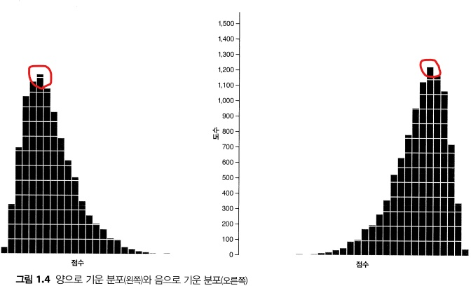 

- kurt(첨도): 음수면 분포가 평평하고 꼬리가 가늠, 양수면 분포가 뾰족하고 꼬리가 뚜거움


- 비대칭도, 첨도 모두 0에 가까울 수록 이상적임
- e-01: "e"는 10을 의미 하고, "-01"은 10의 1제곱을 의미 ex)e-01= 0.1, e-02= 0.01

**round()함수**

소수점, 과학적표기법(7.900000e-01) 같이 보기 어렵고 긴 유효숫자는 필요 없음, 유효숫자를 줄이기 위해 함수를 사용
```
round(stat.desc(dlf[, c("day1", "day2", "day3")], basic = FALSE, norm = TRUE), digits = 3)
#>                day1  day2  day3
#> median        1.790 0.790 0.760
#> mean          1.771 0.961 0.977
#> SE.mean       0.024 0.044 0.064
#> CI.mean.0.95  0.048 0.087 0.127
#> var           0.481 0.520 0.504
#> std.dev       0.694 0.721 0.710
#> coef.var      0.392 0.750 0.727
#> skewness     -0.004 1.083 1.008
#> skew.2SE     -0.026 3.612 2.309
#> kurtosis     -0.422 0.755 0.595
#> kurt.2SE     -1.228 1.265 0.686
#> normtest.W    0.996 0.908 0.908
#> normtest.p    0.032 0.000 0.000
```
- digits: 원하는 유효숫자 개수를 지정(ex:digits= 3 소숫점 이하 3자리, digits= 4 소숫점 이하 4자리)

**z점수**

비대칭도와 첨도가 유용하지만, 점수를 z점수로 변환해서 보는 것도 좋다. z점수는 평균0, 표준편차1인 분포에 맞추어 변환한 값이다.

- z점수 변환하는 이유

` `1. 서로 다른 측정 방법으로 얻은 서로 다른 표본들의 대칭도와 첨도를 비교할 수 있다.

` `2. 자료의 비대칭도와 첨도가 발생할 활률을 파악할 수 있다.

**z점수로 변환 방법**

점수에서 분포의 평균을 빼고 분포의 표준편차로 나눔


- S값: 비대칭도, K값: 첨도, SE: 표준오차
 
**핵심정리**

- 점수들의 분포가 정규분포와 어느 정도나 비슷한지 파악하는 한 가지 방법은 점수들의 비대칭도와 첨도를 확인하는 것
- 비대치도가 양수이면 정규분포보다 작은 점수들이 많이 있는 것이고, 음수이면 더 큰 점수들이 많이 있다는 것
- 첨도가 양수이면 분포가 뾰족하고 꼬리가 두껍다는 뜻이고, 첨도가 음수이면 분포가 평평하고 꼬리가 가늘다는 뜻
- 비대칭도와 첨도가 0에서 멀수록 자료의 분포가 정규분포에서 많이 벗어난 것
- 비대칭도와 첨도의 유의성을 점검할 수도 있지만, 표본이 클 때는  그렇게 하지 말아야 함