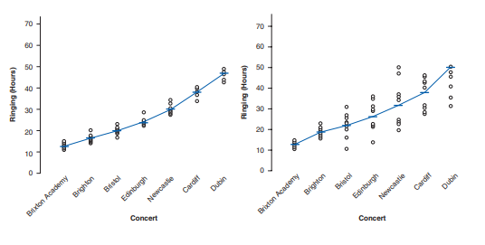
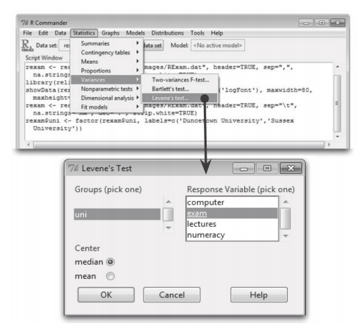
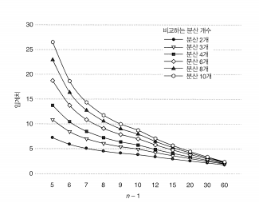
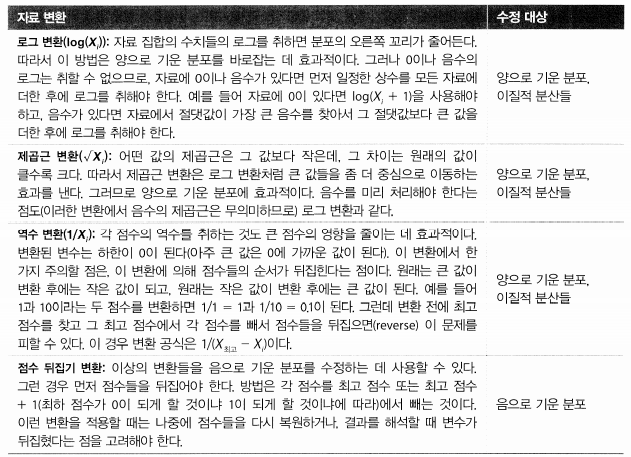

```{r setup, include=FALSE}
knitr::opts_chunk$set(echo = TRUE)
```

## 5.7 분산의 동질성 검정

분산 동질성이란 

- 자료들을 수집한 경우에 비교 그룹들의 분산이 동일해야 된다는 것이다.
 EX) 한 청각학자가 시끄러운 콘서트가 청력에 미치는 영향에 대해 실험해해보았다. 시끄러운 콘서트들이 끝난 후 사람들의 이명이 지속되는 시간을 측정했다. 


**그림 5.6 분산이 동질적인 자료를 나타낸 그래프(왼쪽)/분산이 이질적인 자료를 나타낸 그래프 (오른쪽)**
 
 그림 5.6은 두종류의 참가자들의 지속시간으 나타낸 것이다. 두 그래프에서 원은 참가자들의 이명 시간이고 짧은 수평선은 해당 공연에서 참가자들의 평균 이명 지속시간이다.
 두 그래프 모두 평균들을 연결한 선을 보면 공연 횟수가 믈수록 참가자들의 평균 이명 시간이 길어짐을 알 수 있다.
첫 공연 후의 참가자들의 이명 시간은 약 12시간, 두번째는 15~20시간이고, 마지막 공연의 이명시간은 45~50시간이다.
따라서 공연의 큰음량이 누적되면서 이명에 시간도 길어지는 것을 볼수 있다.

이 패턴은 두 그래프에서 발견된다. 두 그래프의 차이는 평균이 아니라 평균 주위에 점수의 분포에 있다.
왼쪽 그래프를 보면, 평균을 중심으로 한 점수 분산은 각 공연 이후에도 그대로 유지된다.
바꿔 말하면, 한 공연이 끝난 후에 최저점과 최고점의 거리와 다음 공연이 끝난 후의 해당 부분은 상당히 비슷할 것이다.
청각 손실 평균은 올라가지만 점수들이 퍼져있는 정도는 공연마다 비슷한 수준이다. 
이것은 분산의 동질성이 의미하는 것이다.
오른쪽 그래프는 브릭스턴 콘서트 이후 점수 스프레드를 보면 평균 주위에 꽤 빽빽하게 들어차 있지만 더블린 쇼 이후에는 평균을 중심으로 점수가 매우 넓게 퍼져 있는데 이것은 분산의 이질성을 보여주는 예다.

### 5.7.1 레빈 검정 

분산 값을 보고 분산 값이 비슷한지 확인할 수 있지만, 이러한 접근법은 주관적이지 못합니다.
대신에, 회귀 분석과 같은 상관 분석에서 우리는 그래프를 사용하는 경향이 있고 데이터 그룹에 대해서는 Levene의 검정이라고 불리는 테스트를 사용하는 경향이 있다.
Levene의 검정은 다른 그룹의 분산이 같다는 귀무 가설을 검정한다.
편차 점수, 즉 각 점수 간의 절대적 차이와 그것이 나온 그룹의 평균에 대해 시행된 일원 분산 분석을 수행함으로써 작동하는 매우 간단하고 테스트 입니다.
현재 우리가 알아야 할 것은 만약 Levene의 테스트가 p ≤ 0.05에서 유의하다면, 우리는 귀무 가설이 부정확하고 분산이 유의하게 다르다고 결론을 내릴 수 있다는 것이다. 따라서, 분산의 동질성에 대한 가정은 위반되었다.
 
#### 5.7.1.1 Rcommander를 이용한 레빈 검정 실행 1
 
 R commander로 자료를 불러온다. 데이터 => 데이터 불러오기 => 텍스트 파일, 클립보드, 또는 url 을 이용해서 R Exam.dat
 파일을 불러온다.이 자료에 레빈 검정을 수행히려면 uni변수를 요인으로 변환한다. 변환하고 나면 통계 => 분산=>레빈 검정을 선택할수 있게 된다. 메뉴에서 이 옵션을 선택하면 그림 5.7에 표시된 대화 상자가 열린다. 그룹화 변수를 선택해야 한다.다음으로  uni로 정의되는 그룹들 사이에서 분산의 동질성를 점검할 변수를 목록에서 선택하고 평균과 중앙값을 중심으로 할 것인지를 선택하는 옵션도 있다
 그림 5.8에 exam에 대한 결과와 numeracy에 대한 결과가 나와 있다.


 
 **그림 5.7 R commander를 이용한 레빈검정 실행**
 

#### 5.7.1.2 R를 이용한 레빈 검정 실행 1

R에서 직접 레빈 검정을 실행 할때는 car 패키지의 leveneTest() 함수를 사용한다.


```{r data , include=FALSE}
rexam <- read.delim("rexam.dat", header=TRUE)
```

```{r test 1, eval=FALSE}
  leveneTest (결과변수, 그룹화 변수,  center = median/mean)
```

함수에 두 변수를 입력한다.
첫째, 분산을 검정하려는 결과 변수와 둘째는 그룹화 변수 인데 반드시 지정해 주어야 한다.
변수들만 지정해서 함수는 중앙값을 중심으로 변수들을 처리한다.
만약 중앙값 대신 평균을 사용하고 싶으면 **center="mean"** 추가하면 된다

```{r test 2, eval=FALSE}
  leveneTest(rexam $ exam, rexam $ uni)

  leveneTest(rexam $ exam, rexam $ uni, center = mean)
```

수치계산력 점수를 검정하고 싶다면 다음과 같이 실행하면 된다.(결과변수만 바뀜)

```{r test 3, eval=FALSE}
 leveneTest(rexam $ numeracy, rexam $ uni)
```

#### 5.7.1.3 레빈 검정의 출력 1

출력 5.8은 R 시험 점수에  대한 (중앙값과 평균) 레빈 검정 결과와 수치 계산력에 대한 결과이다.
중앙값과 평균 모두에서, 심험 점수의 검정 결과는 유의 하지 않다.이는 분산들이 그리 다르지 않다는 뜻이다.
그러나 수치계산력 점수에 대한 레빈 검정은 유의 하다 그래서 분산들이 유의 하며 분산의 동질성 가정이 깨졌다는 뜻이다

**출력5.8**

```{r test 4 , include=FALSE}
library(car)
library(pastecs)
library(psych)
library(lawstat)
library(Rcmdr)
library(foreign)
```

```{r test 5, warning=FALSE}
leveneTest(rexam$exam, rexam$uni)
```

```{r test 6, warning=FALSE}
leveneTest(rexam$exam, rexam$uni, center = mean)
```

```{r test 7, warning=FALSE}
leveneTest(rexam$numeracy, rexam$uni)
```

### 5.7.2 레빈 검정의 보고 1

레빈 검정을 대문자 F로 표기한다.두 가지 다른 자유도(degree of freedom)가 있다.
레빈 검정의 결과는 F(df1, df2) = 값 Pr(>F)로 보고할 수 있다. 
Output 5.8의 결과 참조
 
R 시험점수에 대한 레빈의 결과는  F(1, 98) = 2.09 P =.15 두 대학교에 분산은 크게 다르지 않는다
하지만 수치 계산력 점수는 F(1, 98) = 5.37 P = 0.23  두그룹의 분산이 차이가 많이 있다는 것을 알 수있다. 

### 5.7.3 하틀리의  Fmax: 분산비 1

레빈 검정에서도 표본이 크면 그룹 분산들이 조금만 달라도 유의한 결과가 나올수 있다.
이점을 참작해서 검정 결과를 이중으로 확인하는 방법은 분산 비라고 하는 하틀리의  Fmax를 보는 것이다.
분산비는 서로 다른 그룹들의 분산들의 비인데 더 큰 분산이 분자에 쓰인다. 그래서 분산비를 히틀리가 출판 한 표의 임계치들과 비교해 분산들의 동질성을 판정한다.

그림 5.8에 몇가지 임계치들과 비교함으로써 분산들의 동질성을 판정한다. 
그래프를 보면 그룹, 10 미만의 Fmax는 항상 중요하지 않으며 그룹당 15–20의 비율은 약 5 미만이어야 하며, 표본이 30–60인 경우 그 비율은 약 2 또는 3 미만이어야 한다



__그림 5.8 하틀리의  Fmax 검정에 쓰이는 몇가지 임계치들__

핵심정리 **분산의 동질성**

- 분산의 동질성 가정은  서로 다른 그룹들에서 점수들이 퍼진 정도가 대략 같은 것이라는,
좀더 일반화하자면 점수들이 퍼진 정도가 예측변수의 서로 다른 지점들에서 동일할 것이라는 가정이다.

- 그룹을 비교할 때는 레빈 검정을 이용해서 검사 할 수 있다.

- 레빈 검정의 결과가 유의하면(R의 출력에서 Pr (>F)가 0.05보다 작으면) 그룹들의 분산들이 유의하게 다를 것이다.

- 그렇지 않으면 분산의 동질성 가정이 성립하는 것이다.

- 분산비는 가장 큰 그룹의 분산을 가장 작은 그룹 분산으로 나눈 것이다. 이 값이 그림 5.8에  나온 임계치보다 작아야 분산의 동질성 가정이 성립한다.

- **주의**  표본이 클때는 그룹 분산들이 그리 다르지 않아도 레빈 검정이 유의한 결과를 낼 수있다.
따라서 레빈 검정 결과를 분산비와 함께 해석할 필요가 있다.

## 5.8 자료의 문제점 수정 2
이부분에서는 문제점들을 어떻게 해결 할것인지를 살펴보는 것이다.

### 5.8.1 이상치 처리 2

1.**해당 사례를 제거한다.** 
  
- 이상치를 제공한 사람의 자료를 왼전히 제거는 것이다.

2.**자료를 변환한다.**
  
- 이상치들이 있으면 분포가 기우는 경향이 생기는데, 다음 절에서 보겠지만 자료에 변환을 가하면 그러한     비대칭이 줄어들 수있다.

3.**점수를 변경한다.**
  
- 계속 문제가 사라지지 않는다면, 이상치를 다른 점수로 대체하는 방법도 있다.
  
  a. **다음 최고 점수 더하기 1** : 가장 높은 값보다 단 단위 위의 점수로 바꾼다
  
  b. **z 점수에서 복원** : 복원 공식은 X = (z × s) + X 이다. 먼저 데이터의 평균과 표준 편차를 계산하고 표준편차에 3.29을 곱한후에 평균을 더하면 점수가 나온다. 그점수로 대체한다.
  
  c. **평균 더하기 표준펀차의 두배** : 평균에 표준편차의 두배를 더한 값은 사용한다.

### 5.8.2 비정규성과 분산의 이질성 처리 2

#### 5.8.2.1 자료변환 2

자료를 변환 한다는 것이 이상하게 생각할수도 있다 하지만 특정 점수 하나가 아니라 모든 점수를 같은 식으로 변환하는 것이다. 모든 점수를 변환하면 변수들의 관계는 변하지 않지 때문이다.
그러나 점수차이는 변하게 된다.변수들의 관계를 살펴보는 경우라면 문제가 되는 변수를 변환해도 무관하지만 변수들의 안에서의 차이를 살펴볼때는 변수들이 모든 수준을 변환해야한다.

#### 5.8.2.2 변환의 선택 2

사용할수 있는 변환이 많으므로 주어진 자료를 적용하기에 종은 방법은 시행착오이다.
변수들 사이의 차이를 살펴 볼때는 반드시 모든변수의 같은 변환을 적용해야 한다.


**5.1** 자료 변환 방법과 그용도




   


 
 
 