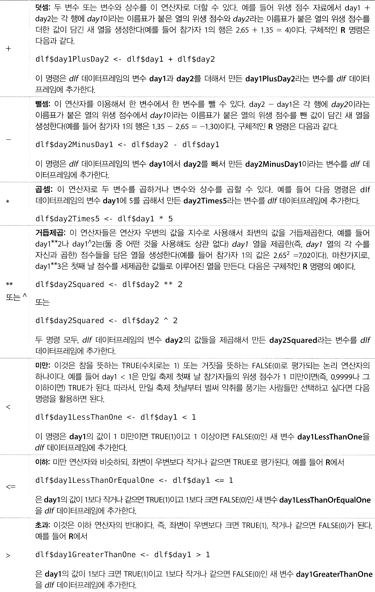
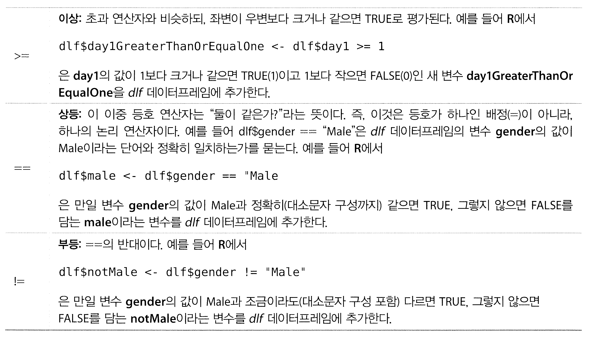
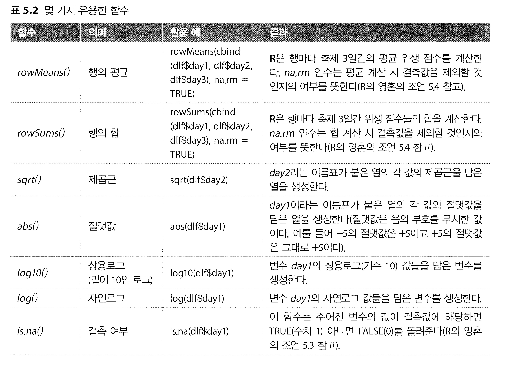
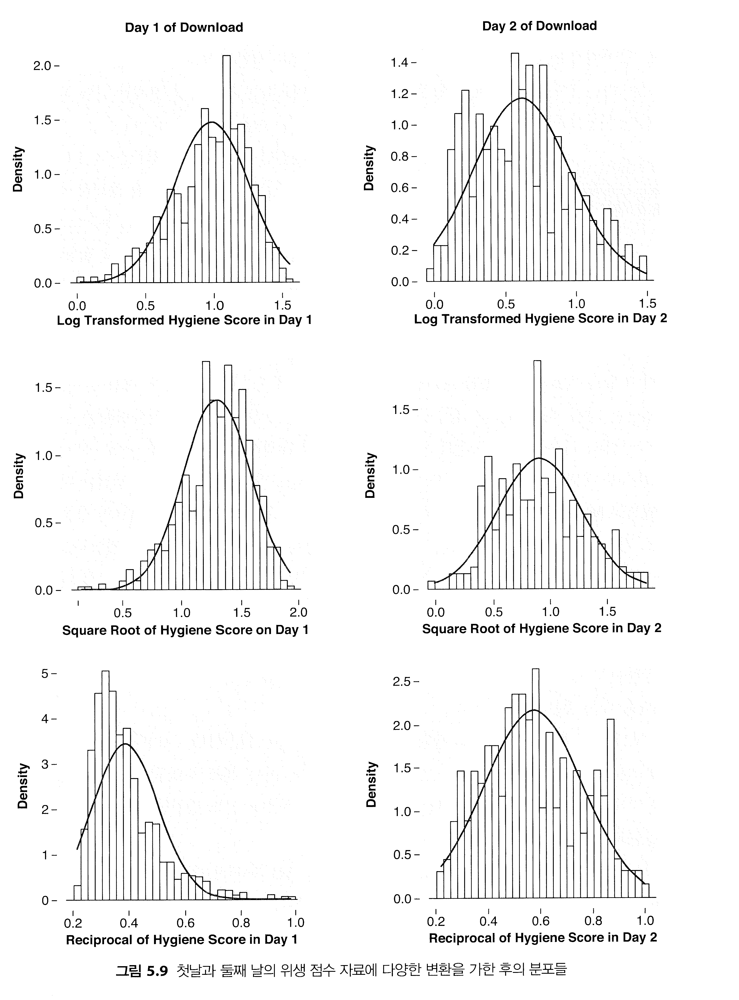

```{r setup, include=FALSE}
knitr::opts_chunk$set(echo = TRUE)
```


## 5.8.3 R을 이용한 자료 변환②

### 5.8.3.1 새 변수의 계산②

R을 이용하면 아주 쉽게 자료를 변환할 수 있다. <BR>
자료의 변환의 일반적인 형태는 두 가지이다.<BR> 
첫 형태는 다음과 같다.

```
새변수 <- 함수(기존변수)
```

여기서 function은 변수를 변환하는 데 사용할 함수이다. 둘째 형태는 다음과 같다.
```
새변수 <- 기존 변수(들)로 이루어진 산술 표현식
```
그럼 산술 표현식에 사용할 수 있는 산술 연산자들부터 살펴보자.




표 5.2는 
가장 유용한 변환 함수들을 정리한 것이다. <BR>
이 표는 함수의 일반적인 형태와 의미뿐만 아니라 활용 예와 그 결과도 제시한다.<BR> 
표에는 평균, 표준편차, 여들의 합을 계산하는 기본적인 함수들이 나와 있으며,<BR> 기운 분포의 자료를 변환하는 데 유용한 제곱근 함수와 로그 함수도 나와 있다.<BR> 제곱근과 로그는 다음 절들에서 실제로 사용해 볼 것이다. 




결측자료의 개수를 세고 싶을 때는 is.na()를 사용하면 된다.<BR> 예를 들어 다음은 둘째 날의 위생 점수가 없는 사람들을 파악하는 명령이다.

```
dlf$missingDay2 <- is.na(dlf$day2)
```


이 변수를 교묘한 방식으로 활용할 수 있다.<BR> 
예를 들어 둘째 날 위생 점수가 누락된 사람들의 수를 세려면 어떻게 해야 할까? 그런 사람은 이 변수의 값이1(TRUE)이므로, 다음처럼 1들을 모두 더하면 답이 나온다


```
sum(dlf$missingDay2)
```


결측 점수의 수만 알고 싶다면 굳이 새 변수를 만들 필요 없이 다음처럼 두 함수를 함께 사용하면 된다. 


```
(sum(is.na(dlf$day2))
```

이 명령을 실행하면 546개의 점수가 빠졌다는 답이 나온다. <BR>그 점수들의 비율은 어느 정도일까? is.na는 결측 점수에 대해서는 1. 그렇지 않은 점수에 대해서는 0에 해당하는 값을 돌려주므로, 그 값들의 평균이 곧 결측 점수들의 비율이다.


```
mean(is.na(dlf$day2))
```

이 명령은 평균이 0.674임을 말해준다.<BR> 
따라서 둘째날 위생 점수가 없는 사람이 67.4%이다.<BR>


### 5.8.3.2 R을 이용한 로그 변환② <BR>
새 변수를 계산하는 기본적인 방법을 배웠으니, 그것을 이용해서 위생 점수 자료를 변환해 보자. <BR> 
우선 변수 day1의 점수들을 변환해서 logday1이라는 새 변수를 만든다. <BR>


```
dlf$logday1 <- log(dlg$day1)
```

이 명령은 day1 변수의 값들의 자연로그 값들로 이루어진 logday1이라는 변수를 dlf데이터 프레임에 추가한다.<BR> 
둘째 날 위생 점수들도 변환해 보자. 한 가지 문제는 둘째 날 위생 점수에는 0이 포함되어 있는대, 0의 자연로그 값은 존재하지 않는다는 것이다. 이 문제를 극복하려면 원래의 점수들에 상수를 더한 후에 로그를 취해야 한다. 점수가 0보다 커지기만 한다면 어떤 상수라도 좋다. 지금 예에서 자료집합의 최하 점수가 0이므로, 그냥 모든 점수에 상수1을 더하면 모든 점수가 0보다 커진다.
어떤 상수라도 좋다고 했지만 지금 예에서는 1이 되는데, 1의 자연로그는 0이기 때문에 원래의 자료에서 0점인 사람은 변환후에도 0점이 된다는 장점이 있기 때문이다. 다음은 이러한 변환을 수행하는 명령이다. 

```
dlf$logday2 <- log(dlf$day2 + 1)
```

이 명령은 day2 변수의 값들에 1을 더한 결과의 자연로그 값들로 이루어진 logday2라는 변수를 dig데이터프레임에 추가한다

###5.8.3.3 R을 이용한 제급근 변환② <BR>

제곱근 변환도 마찬가지 방식으로 진행된다. 필요한 함수는 sqrt이다. 다음은 변수 day1의 값들의 제곱근을 담은 sqrtday1이라는 변수를 생성하는 예이다.
```
dlg$sqrtday1 <- sqrt(day1)
```


# 5.8.3.4 R을 이용한 역수 변환② <BR>

역수 변환은 함수대신 1/변수라는 산술 표현식을 사용한다. 그런대 둘째 날 자료에는 0이 포함되어 있으므로, 그 표현식을 그대로 사용하면 0으로 나누기에 관한 오류가 발생한다(0으로 나누는 것은 금지되어 있다). 따라서, 로그 변환에서처럼 먼저 해당 변수에 적당한상수를 더해 주어야 한다. 점수들이 0이 아닌 값이 되기만 한다면 어떤 상수라도 좋겠지만 지금 예에서는 1이 적당하다. 다음은 첫날 위생 점수들의 역수를 담은 recday1이라는 변수를 데이터 프레임에 추가하는 예이다.

``` 
dlg$recday1 <- 1/(dlg$day1 + 1)
```

# 5.8.3.5 R의 ifelse() 함수② <BR>

ifelse() 함수는 주어진 조건에 따라서 두 가지 값 중 하나를 돌려주는 함수로, 조건에 따라 다른 값을 지정해서 새 변수를 만들거나 기존 변수를 변경할 때 사용할 수 있다. 일반적인 형태는 대음과 같다.

igelse(조건 인수, 조건 인수가 TRUE일 때의 값, 조건 인수가 FALSE일 때의 값)

이 함수는 세 개의 인수를 요구한다. 하나는 판정할 조건을 지정하는 인수이고, 또 하나는 그 조건이 참일 때의 값을 지정하는 인수, 그리고 마지막은 그 조건이 거짓일 때의 값을 지정하는 인수이다. 그럼 day1의 위생 점수에 이상치가 존재하는 원래의 자료에 대해 이 함수를 사용해 보자. 위생 점수는 4점 만점이므로, 4보다 큰 값이면 이상치에 해당한다. 따라서, 첫째 날 위생 점수들에서 이상치를 검출하여 조건은 dif$day1 > 4이다. 이 조건은 "만일 day1의 값이 4보다 크면" 이라고 해석할 수 있다. 이 조건이 참이면 해당 점수를 결측값(NA)으로 설정하고, 그렇지 않으면 점수를 그대로 유지한다고 하자. 다음은 이에 해당하는 명령이다.

```
dlf$day1noOutlier <- ifelse(dlf$day1 > 4, NA, dlf$day1)
```

이 명령은 day1NoOutlier라는 새 변수를 생성하는데, 이 새 변수의 값은 만일 day1의 값이 4보다 크면 NA이고 4보다 작거나 같으면 day1의 값 그대로이다.


변수에 결측자료가 존재한다면, rowMeans() 같은 함수를 하용할 때 조심하지 않으면 원하는 답을 얻지 못한다. 이때 관건은 결측자료를 취급하는 방식을 제대로 결정하는 것이다. 이런 문제를 생각해 보자. 나에게 오렌지 두 개와 사과 세 개가 있다. 내가 가진 과일은 총 몇 개일까? 다아연히 다섯 개이다.
개수는 결측값이다. 이때 여러분의 과일은 몇 개인가? 두 개라고 말할 수도 있고, 알 수 없다고 말할수도 있다. 만일 R에서 사과 개수와 오렌지 개수를 더하면, 대부분의 함수는 NA(알 수 없음)라는 답을 낸다

```r
apples <- 2
oranges <- NA
apples + oranges
[1] NA
```

다행히 rowSums 함수와 rowMeans 함수에서는 결측자료가 처리하는 방식은 ra.rm 옵션을 통해서 지정할 수 있다. 이 옵션에서 na는 결측값을, rm은 제거 (remove)를 뜻한다.

3일간 평균 위생 점수를 다음 명령으로 계산한다고 하자.

```
dlf$meanHygiene <- rowMeans(dlf$day1, dlf$day2, dlf$day3), na,rm = TRUE
```

그런데 위생 점수를 3일이 아니라 100일간 매일 측정했다면 어떨까? 그리고 점수가 한두 개 빠진 정도면 평균을 계산하되 점수가 아예 없거나 하나밖에 없는 사람들은 평균을 계산하지 않으려면 어떻게 해야 할까? 이런 경우에는 다음 처럼 is.na() 함수를 이용해서 결측값들의 개수를 세어두는 것이 좋다. 

```
dlf$daysMissing <- rowSums (cbind (is.na(dlf$day1),
                                   is.na(dlf$day2),
                                   is.na(dlf$day3)))
```
(하나의 명령을 이처럼 여러 줄로 나누어 입력해도 된다. 이렇게 하면 코드를 읽기 쉬워져서 실수를 저리를 여지가 줄어들기도 한다.) 그런 다음에는 다음처럼 ifelse() 함수를 이용해서 위생 점수를 적어도 두 개인(즉. 결측값이 최대 하나인) 사람들만 평균을 계산할 수 있다.

```
dlf$meanHygiene <- ifelse(dlf$daysMissing < 2, NA,
                          rowMeans(cbind( dlf$day1,
                                          dlf$day2,
                                          dlf$day3),
                                          na.rm=TRUE))
```

인수들이 어떤 함수에 속하는지 명확히 나타내기 우해 적절히 줄을 바꾸고 들여 썼음을 주목하기 바란다. 이렇게 하면 실수를 범할 여지가 줄어든다.


# 5.8.3.6  변환의 효과② <BR>

그림 5.9는 페스티벌 첫날과 둘째 날의 서로 다른 세 가지 변환을 적용한 후의 분포를 나타낸 것이다. 이들을 그림 5.2에 나온, 변환되지 않는 분포들과 비교해 보자. 둘째 날의 분포를 보면, 면환 후에는 분포가 양으로 기운 정도가 줄어들었음을 알 수 있다. 그러나 첫날의 분포는 사정이 다르다. 이 자료는 원래부터 어느 정도 대칭적이기 때문에, 로그 변환과 제곱근 변환 후에는 분포가 조금 음으로 기울었고 역수 변환 후에는 양으로 기울었다! 만일 둘째 날 점수들의 변환이 주는 이득이 첫째 날 점수들의 변환에서 생기는 문제점보다 클 것인지 판단해야 한다. 이처럼, 종종 자료의 분석은 까다로운 결정을 요구한다.


## 5.8.4 자료 변환으로 해결이 안되는 문제가 있다면③ <BR>


자료의 변환이 모든 가정 위반에 대한 궁극의 해답인 것처럼 느껴지겠지만, 자료 변환이 항상 바람직하지는 않은 이유들이 존재한다. 특히, 자료 변환이 실제로는 문제를 해결해 주지 못하거나, 문제를 해결하긴 하지만 그 과정에서 다른 문제를 유발하기도 한다. 이런 일은 여러분이 상상하는 것보다 훨씬 자주 발생한다. 어쩔 수 없을 정도로 엉망인 자료를 다루어야 하는 난감한 상황에 빠졌을 때 시도해 볼 만한 방법이 몇 가지  있다, 

**-첫 번째는 자료가 정규분포라는 가정을 두지 않는 검정을 사용하는 것이다. **




이후 여러 장에서 그런 검정들을 소개할 것이며, 그런 검정들만 다루는 장도 있다. 비모수적 검정에 관해서 여러분이 바로 알아채게 될 한 가지 사항은, 그런 검정들이 상당히 제한된 범위의 상황들만을 위해 고안된 것이라는 점이다. 따라서, 그냥 두 개의 평균을 비교하는 경우라면 행복한 날이 되겠지만, 복잡한 실험설계를 다룬다면 조이 디비전의 노래를 듣는 슬픈 날이 될 것이다. 좀 더 유망한 접근 방식은 건강한 검정을 사용하는 것이다. 그런 검정은 컴퓨터들이 점점 정교해지는 추세에 맞게 개발된 것이다. 그런 검정들의 작동 방식은 이 책의 범위를 넘는 주제이지만, 

두 가지 간단한 개념을 알면 어느 정도 감을 잡을 수 있을 것이다. 그런 검정 중 일부는 **절사평균**이라는 것을 활용한다. 

**절사평균**은 그냥 분포의 양극단에서 일정 비율의 점수들을 제거한 후의 분포에 기초한 평균이다. 예를 들어 10% 절사평균은 상위, 하위 10%의 점수를 제거한 후 평균을 계산할 것이다. 절사평균을 구할때는 양 극단에서 점수들을 몇 퍼센트나 제거할 것인지를 결정해야 한다. 예를 들어 점수들의 5%나 10%를 제거할 수 있고, 심지어 20%를 제거할 때도 있다. 
이와 비슷한 강건한 위치 측정 방법으로 


**M 추정량** 이라는 것이 있는데, 절사평균과 차이는 절사의 양을 실험적으로 결정한다는 것이다. 다른 말로 하면, 분석 이전에 자료를 잘라낼 것인지를 연구자가 결정하는 것이 아니라, 어떠한 추정량(이를테면 평균)을 강건하게 구하려면 자료를 얼마나 잘라내는 것이 최적인지를 정해진 절차에 따라 계산한다. 이 방법은 자료를 필요한 것보다 많이 또는 적게 잘라내는 위험을 피할 수 있다는 명백한 장점을 가지고 있지만, 항상 하나의 해법에 도달하는 것은 아니라는 단점도 있다. 다른 말로 하면, M추정량에 기초한 강건한 검정이 항상 답을 내는 것이 아니다.


제 2장에서 보았듯이 평균의 정확도는 분포의 대칭성에 의존한다. 그러나 절사평균은 분포가 대칭이 아니라도 정확한 결과를 낸다. 이는, 분포의 양끝을 잘라내면 평균을 치우치게 만드는 이상치들과 비대칭도가 제거되기 때문이다. 일부 강건한 방법들은 이러한 걸사평균과 M추정량의 속성들을 활용한다. 


또 다른 일반적 해결책은 **부트스트랩**이다, 
부트스트랩에 깔린 착안은 대단히 간단하고 우아하다. 모집단에 직접 접근할 수 없는 경우 우리는 표집분포도 정규분포라고 간주할 수 있다. 그러나 자료가 정규분포를 따른지 않는다면, 표본이 크지 않는한 표집분포의 형태를 추측할 수 없다는 문제가 발생한다. 


부트스트랩 방법은 표본 자료로 부터 표집분포의 속성들을 추정함으로써 이 문제를 해결한다. 간단히 말하면, 이 방법에서는 표본 자료를 하나의 모집단으로 취급해서 그것으로부터 더 작은 표본들을 수집한다. 그러한 각 표본에서 원하는 통계량을 계산하고, 다수의 표본을 취함으로써 표집 분포를 추정할수 있다. 이 통계량의 표준오차는 부트스트랩 표본들로 만든 표집분포의 표준편차로 부터 추정한다. 그리고 그 표준오차를 이용해서 신뢰 구간들과 유의성 검정을 계산할 수 있다. 이는 표집분포의 형태를 알지 못하는 문제를 아주 멋지게 피해가는 방법이다. 부트스트랩을 절사평균 M추정량과 함께 사용하는 것도 가능하다. 부트스트랩 개념에 관한 비교적 읽기 쉬운 입문자로서는 [wright, London, & Field.2911]이 있다.


절사평균, 부트스트랩, M 추정량에 기초한 여러 강건한 검정 방법들이 랜드 윌콕스의 결정적인 교과서에 설명되어 있으니 참고하기 바란다. 그는 그런 검정들을 수행하는 R 함수들도 작성했다. 이 책에서도 그 검정들 중 여러개를 설명한다. 윌콕스의 함수들에 접근하는 방법은 두 가지인데. 
-하나는 해당 패키지를 설치하는 것이고  
-다른 하나는 윌콕스의 웹사이트에서 관련 코드를 직접 내려받는 것이다. 

해당 패키지의 이름은 WRS이다(비록 이 패키지는 현재 베타버전이지만, 그렇다고 미완성의 작품이라는 뜻이 아니다). 다음은 R에 이 패키지를 설치하고 불러오는 명령들이다.

```r
install.packages("WRS", repos="http://R-Forge.R-project.org")
library(WRS)
```
다른 패키지들을 설치할 때와는 달리 이름 다음에 repos="http://R-Forge.R-project.org를 지정했음을 주목하자. 아직 이 패키지는 완전한 릴리스 상태가 아니라서 공식 패키지 저장소에 들어있지 않으며, 그래서 R패키지 파일이 있는 장소를 이처럼 알려주어야 한다. 그런데 이 패키지가 항상 R자체의 최신 버전에 맞게 갱신되지는 않으며, 또한 윌콕스의 웹페이지에 있는 최신버전에 맞게 갱신되지 않는 경우도 많다. 따라서 비록 지금까지 나온 다른 패키지들과는 좀 다른 방식이기는 하지만, 윌콕스의 웹사이트 함수들의 소스 코드를 직접 R 환경에 도입하는 방법도 고려할 필요가 있다. 해당 명령은 다음과 같다.

source("http://dornsife.usc.edu/assets/sites/239/docs/Rallfun-v34.txt")

이 명령은 Source() 라는 함수를 이용해서 웹상의 텍스트 파일에 담긴 윌콕스의 소스코드를 R에 도입한다. 여기서 Rallfun-34.txt는 파일이름이다. 당연한 말이겠지만 이 명령이 제대로 작동하려면 여러분의 컴퓨터가 인터넷에 연결되어 있어야 한다. 아마 이 책이 여러분의 손에 쥐어질 때면 파일 이름이 바뀌었을것이다(이를테면 Rallfun-v35.txt나 Rallfun-v36.txt 등). 따라서, 
만일 파일 이름이 바뀌어서 위의 명령이 제대로 작동하지 않는다면 http://dornsife.usc.edu/labs/rwilcox/software/에서 최신 파일로 링크를 찾아서 그 URL로 Source()를 실행하기 바란다. 이후의 내용은 패키지를 설치하든 파일을 직접 가져오든 여러분의 R 환경에서 윌콕스의 책에 나온 모든 함수를 사용할수 있게 되었다고 가정한다. 