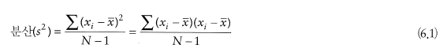

```{r setup, include=FALSE}
knitr::opts_chunk$set(echo = TRUE,
                      warning = FALSE, message = FALSE)
```

# 제 6장 상관

## 6.1 이번장에서 배우는 내용
- 양의 상관 
- 무상관 
- 음의 상관
- 공분산
- 상관계수

## 6.3 관계를 측정하는 방법

- 두 변수가 어떤 식으로든 관계가 있는지 파악하는 가장 간단한 방법은 두 변수의 분산에 **공통점이 있는지** 보는 것이다. 

- **공분산(Covariance)개념**을 이해하려면 분산 개념을 이해해야한다. 
- **분산**은 점수들이 평균과 얼마나 떨어져 있는지를 나타낸다. 


  
- **x바는 표본의 평균**이고 **x아이는 주어진 자료점**, **N은 관측값들의 개수**이다.  

- 이해를 돕기 위한 예로 여러 편의 광고를 보여주고 그 다음 한 주 동안 사들인 타피 사탕 봉지의 수를 측정    

- 두 변수에 어떤 관계가 존재한다면, 한 변수가 평균에서 벗어나는 방식은 다른 변수가 평균에서 벗어나느 방식과 같거나 그 반대 방향일 것이다. 


  
  
- 두 변수의 편차 패턴들 사이의 유사성을 구체적인 수치로 나타내려면 어떻게 해야 할까?   

- 편차를 합치면 양의 편차와 음의 편차가 상쇄되어버린다. 그래서 일반 변수는 이를 제곱을 해서 해소시킨다.   

- 변수가 두개인 경우에는 각 편차를 제곱하는 대신 두 변수의 편차를 곱하는 방법이 있다.  

- 만일 두 편차의 값이 둘 다 양수이거나 둘 다 음수이면 그 곱은 양수가 되고(두 편차가 방향이 같다는 뜻), 하나만 음수이면 곱은 음수가 된다(두 편차가 방향이 다르다는 뜻), 이렇게 한 변수의 편차를 다른 변수의 해당 편차와 곱한 것을 **교차곱 편차(cross-product deviation)**이라고 부른다.   

- 각 교차곱편차들을 모두 더해 n-1로 나눠주면 이게 **공분산**이다.   


### 공분산 해석  

- 공분산 계산은 **두 변수에 관계가 존재하는지**의 여부를 파악하는 데 좋은 방법이다.   

-> 공분산이 양수 : 한 변수가 평균에서 이탈하면 다른 변수도 **같은 방향**으로 이탈함을 뜻함  

-> 공분산이 음수 : 한 변수가 평균에서 이탈하면 다른 변수는 그와 **반대 방향**으로 이탈함을 뜻함. 

### 공분산의 문제점  

- 공분산은 측정의 축척에 의존하기 때문에 공분산들을 객관적인 방식으로 비교할 수 없다는 문제가 발생
- 즉, 서로 다른 단위로 측정한 자료 집합들의 공분산들이 주어졌을 때 둘 중 어떤 것이 더 큰지 비교하는 것은 무의미


### 표준화와 상관계수 

- 측정 척도 의존성 문제를 극복하려면 공분산을 어떤 표준 단위로 변환할 필요가 있다. 그러한 변환 과정을 **표준화**라고 부른다. 
- 예를 들어, 사람들의 태도(attitude)를 측정해야 한다면 어떨까? 이럴 때 측정단위로 쓰이는 것이 표준편차이다. 
- 6.1 자료에서 사탕 봉지 수의 표준편차는 2.92인데 편의상 3이라고 하고 그림 6.2에서 참가자 1번의 관측값이 평균보다 3작다. (즉, 편차는 -3봉지이다). 이 편차(-3)를 표준편차 (3)으로 나누면 -1이 나온다. 즉, 참가자 1의 점수와 평균의 차이는 -1 표준편차이다.  
- 평균과 관측값의 차이를 표준편차로 나눔으로써 편차를 표준적인 단위로 표현할 수 있다.  
- 이러한 논리를 연장해서 공분산의 표준화에 적용할 수 있다.  
- 즉, 공분산을 어떤 표준적인 단위로 표현하려면, 그냥 공분산을 표준편차로 나누면 될 것이다. 그런데 문제는, 이 경우 변수가 둘이므로 표준편차도 둘이하는 점  
- 공분산을 계산할 때는 두 가지 편차(변수당 하나)를 계산해서 둘을 곱한다. 표준편차도 마찬가지 방식으로 처리하면 된다.  
- 즉, 두 변수의 표준편차를 곱한 값을 **분모**로 사용하면 되는 것이다.  
-  이런 식으로 계산한 표준화된 공분산을 **상관계수(correlation coeffient)**라고 부른다. 


- 이 상관계수의 좀 더 긴 이름은 **피어슨의 곱적률 상관계수** 또는 **피어슨 상관계수**이다. (이 상관계수는 '칼 피어슨'이 고안했다)    

- 표 6.1을 다시 보면, 시청한 광고 수의 표준편차는 1.67이고 구입한 사탕 봉지 수의 표준편차는 2.92이다. 이 둘을 곱하면 1.67 x 2.92 = 4.88 이다. 그리고 두 변수의 공분산은 이전에 구했듯이 4.25이다. 이를 표준편차 곱으로 나누면 r = 4.25/4.88 = .87이라는 상관계수가 나온다.    

- 공분산을 이런 식으로 표준화하면 -1에서 +1까지의 값이 된다.    

- 상관계수가 +1이라는 것은 두 변수의 관계가 완전한 양의 상관이라는 뜻으로 **즉, 한 변수가 증가하면 다른 변수도 그에 비례하는 양만큼 증가한다.**    

- 반대로 상관계수가 -1이라는 것은 두 변수의 관계가 완전한 음의 상관이라는 뜻이다.  
**즉, 한 변수가 증가하면 다른 변수는 그에 비례하는 양만큼 감소한다.** 그리고 상관계수가 0이면 두 변수에 아무런 선형 관계도 없다는 뜻이다. **즉, 한 변수가 변해도 다른 변수는 변하지 않는다**    

- 상관계수는 관측된 효과의 표준화된 측도이므로 효과의 크기를 측정하는 용도로도 흔히 쓰인다. 상관계수가 ±.1 이면 작은 효과. ±.3이면 중간 효과, ±.5이면 큰 효과에 해당한다.   


### 상관계수의 유의성과 신뢰구간  
- 신뢰구간은 모집단에 있음 직한 어떤 값에 관한 무언가를 말해준다. 상관계수 r에 대한 신뢰구간의 계산은 앞 절에서 말한 zr과 해당 표준오차에 기초한다.  
- 보통의 경우에서 95% 신뢰구간을 구하는 공식은 다음과 같다. 


### 6.3.5 해석에 관한 경고 한마디: 인과 관계  

- 상관계수는 인과관계의 방향을 말해주지는 않는다.
- 제 3 변수 문제: 결과에 영향을 미치는 다른 어떤 변수가 있을 수 있으므로 두 변수사이의 인과관계를 가정할 수 없다.  
- 인과관계의 방향 : 상관계수는 어떤 변수가 다른 변수의 변화를 유발하는지에 관해 아무것도 말해주지 않는다. 

## 6.5 이변량 상관

상관은 두 종류가 있다.

- **이변랑 상관** : 두 변수의 상관관계를 말한다. 피어슨의 곱적률 상관계수, 스피어만, 로와 켄달의 타우도 이변량 상관계수의 예  

- **편상관** : 하나 이상의 다른 변수들의 효과를 '제어' 할 때의 두 변수의 상관관계


  
  
### 편상관과 준편상관 설명    


  

