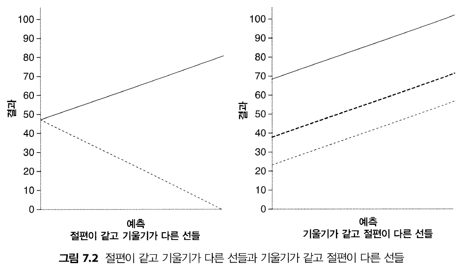

```{r setup, include=FALSE}
knitr::opts_chunk$set(echo = TRUE)
```

Chapter 07. 회귀

## 7.1 이번 장에서 배우는 내용
예시) 노래 대회에서 또 우승하는 방법  
첫 대회에서 우승한 이유를 파악해야 두 번째 대회에서도 우승할 수 있다.  
이를 위한 방법은 자료를 수집하고, 모든 대회 참가자에 대한 평가를 특정 변수로 예측하는 방법이다.  

여기서 변수가 될 수 있는 것은?  
공연자의 나이, 공연 종류 + α(외모 등)  


## 7.2  회귀의 소개
한 변수를 이용하여 다른 변수를 예측하는 것  
e.g.) 강연을 하기까지 남은 시간으로 스트레스 수준을 예측  
기본적으로 둘의 관계가 음의 상관관계라고 예측할 수 있음  
이를 더 확장하여, '강연 시작까지 10분 남은 사람이 얼마나 불안할지' 같은 질문의 답을 구할 수 있음 <= 회귀분석  

**`회귀분석(regression analisys`**: 하나의 모형을 자료에 적합하고 그를 이용하여 하나 이상의 독립변수(IV)로부터 종속변수(DV) 값을 예측하는 것  

- 단순회귀(simple regression): 한 예측변수로부터 한 결과변수를 예측하는 것  
- 다중회귀(multiple regression): 여러 개의 예측변수로부터 한 결과변수를 예측하는 것  


임의의 자료를 다음과 같은 공식을 이용하여 예측할 수 있음(교재 2.4.3)  


* 결과~i~ = (모형) + 오차~i~

자료를 적합시킨 모형에 오차를 더함으로써 특정한 무엇에 관한 결과를 예측할 수 있음

    
회귀분석의 경우, 자료에 적합시키는 모형은 선형(linear)임  
=> 회귀분석에서는 자료 집합을 하나의 직선으로 요약  

자료이 전반적인 추세를 요약하는 직선은 여러 가지  
정확한 예측을 위하여는 자료를 가장 잘 서술하는 모형을 사용해야 함 => 최소제곱법(method of least squares)을 이용  

### 7.2.1 직선에 관한 중요한 정보  

**직선의 요소**: 선의 기울기(slope) => b~0~, 절편(intercept) => b~1~  

**회귀계수(regression coefficient): 매개변수 b~1~과 b~0~

Y~i~ = (b~0~ + b~1~X~i~) + ε~i~  
* ε~i~: 잔차 항(residual term), 직선을 이용해 예측한 것과 실제 값의 차이  


{width="400"}  

두 선의 기울기와 절편이 다르면 그 두 선은 다른 것  
절편은 같지만 기울기가 다른 두 선에서 실선은 양의 상관, 점선은 음의 상관을 나타냄  
기본적으로 기울기(b~1~)는 형태를, 절편(b~0~)은 모형의 위치를 나타냄  


### 7.2.2 최소제곱법
최소제곱법: 자료에 가장 잘 맞는 선(최대한 많은 자료점을 통과하거나 근접하게 지나는 선)을 찾는 방법  
최량적합선(line of best fit): 자료점에 그릴 수 있는 모든 직선 중, 관측된 자료점과 선의 차이가 가장 적음    

잔차(residual): 예측값과 실제로 관측한 자료점 사이의 수직 거리  
자료점이 선 위에 있으면 잔차는 양수, 자료점이 선 아래에 있으면 잔차는 음수가 됨  

{width="400"}  

최량적합선을 찾기 위해서 최소제곱법을 적용하면 됨  
`선을 찾는 자, 네프윅`이 최량적합선의 기울기와 절편을 알려줌 <- 이러한 최량적합선을 회귀선(regression line)이라 부르며, 이는 하나의 회귀모형(regression model)임  


### 7.2.3 적합도 평가: 제곱합, r, R^2^
자료에 대한 선의 **적합도(goodness-of-fit)**: 최량적합선이 실제 자료와 얼마나 일치하는지 평가하는 단계  

* 모형이 자료에서 벗어난 정도 = Σ(관측값 - 모형)^2^    
  
예시) 음반 홍보 비용(X), 실물과 다운로드를 합친 음반 판매량(Y) 예측  
광고비로 10만 파운드를 쓰면 음반이 얼마나 팔릴까?  
광고비로 1 파운드를 쓰면 음반이 얼마나 팔릴까?  
=> 평균은 변수의 관계가 '무상관'인 모형에만 해당  

* 결과를 예측하는 기본 전략 1: 비교기준으로 사용할 모형이 필요 -> 평균을 선택  
평균을 모형으로 사용해서 모형이 예측한 값과 관측값의 차이를 구하고, 위의 식을 이용하여 그 차이를 제곱한 값을 모두 합하는 것(총제곱합, total sum of squares, SS~T~)  

* 결과를 예측하는 기본 전략 2: 보다 정교한 모형의 적합도 구하기(현재 예시에서 최량적합선을 말함)  
위의 식을 이용하여 모형과 관측값 차이의 제곱을 합함  
cf) 차이를 제곱하는 이유: 방향(부호) 다른 차이가 상쇄되는 것 방지  

위의 식을 이용하여 구한 총제곱합을 회귀분석에서는 제곱잔차합(sum of squared residuals) 또는 잔차제곱합(residual sum of squares)라고 부르고 SS~R~로 표기  
=> 최고의 모형을 자료에 적합했을 때, 모형이 자료에서 얼마나 벗어났는지 나타내는 측도  

정리) SS~T~와 SS~R~ 차이는 평균 대신 회귀모형을 사용했을 때, 예측이 얼마나 향상되는지를 나타냄  
모형제곱합(model sum of squares, SS~M~): 향상량  
SS~M~ 값이 크다는 것은 결과변수 예측을 위해 평균 사용과 회귀모형을 사용의 결과가 많이 다르다는 뜻  

{width="400"}  


제곱합들로 구할 수 있는 유용한 측도: 모형에 따른 향상 비율  
* R^2^ = 모형제곱합 / 총제곱합


### 7.2.4 개별 예측변수의 평가
평균처럼 나쁜 모형에서는 예측변수에 대한 회귀계수가 0  
회귀계수가 0이라는 것은?
  1) 예측변수가 변해도 결과의 예측값은 변하지 않음  
  2) 해당 회귀선의 기울기가 0(= 회귀선이 수평선)이라는 뜻  
  => 어떤 변수가 결과를 유의하게 예측하려면, 해당 b 값이 0과는 달라야 함  
  
위 가설을 t검정(제9장에서 배움)으로 검사할 수 있음  
t 통계랑(t-statistic)은 b 값이 0이라는 귀무가설을 검증함  

$t = \frac{b_관측 - b_기대}{SE_b} = \frac{b_관측}{SE_b}$  

t 값은 검정의 자유도에 따라 달라지는 특별한 분포를 따름  
회귀분석의 자유도: N(전체 표본 크기) - p(예측변수 개수) - 1  
단순회귀의 자유도: N - 2 <- 예측변수가 하나뿐이므로  

적용할 t 분포를 결정했다면, t 관측값을 효과가 없을 때(b = 0일 때) 얻을 것이라고 기대되는 값과 비교하기  
t 값이 아주 크면 효과가 없을 때, 해당 값이 발생할 가능성이 적은 것  
R은 b가 실제로 0일 때, 그러하거나 더 큰 t의 관측값이 발생할 정확한 확률을 제공  
일반적인 법칙으로, 관측 유의확률이 .05보다 작으면 b가 0과 유의하게 다르다고 가정 => 그런 경우 예측변수가 결과의 예측에 유의하게 기여


## 7.4 R을 이용한 회귀분석 절차
### 7.4.2 R을 이용한 회귀분석  
lm() 함수를 이용하여 회귀분석을 수행  
* lm = linear model(선형모형)  

새모형 <- lm(결과변수 ~ 예측변수(들), data = 데이터프레임, na.action = 결측값 처리 방식))  

- 새모형: 함수가 생성한 모형에 관한 정보를 담은 객체  
- 결과변수: 예측하고자 하는 변수, 종속변수  
- 예측변수(들): 결과변수를 예측할 때 사용할 하나 또는 목록의 변수  
- 데이터프레임: 결과변수와 예측변수가 있는 데이터프레임  
- 결과변수 ~ 예측변수(들): 추정하고자 하는 모형을 나타냄    
  ~ 기호는 틸더(tilder)로 ~를 예측한다는 뜻  


## 7.5 단순회귀의 해석

### 7.5.3 모형의 활용

**단순회귀**
- 단순회귀는 한 변수로 다른 변수를 예측하는 방법  
- 예측을 위해 직선 형태의 통계적 모형을 자료에 적합함  
- 직선은 자료의 패턴을 가장 잘 요약하는 선  
- 직선이 자료에 얼마나 적합한지 평가하는 방법
  1) R^2^는 애초에 존재하는 변동 중, 모형이 설명하는 변동이 얼마나 되는지를 말함 <- 결과변수 변동 중, 예측변수의 변동과 공유되는 부분의 비율  
  2) F비는 모형으로 설명할 수 없는 변동에 대한, 모형으로 설명할 수 있는 변동의 비 <- 모형이 얼마나 나쁜지를 기준으로 모형이 얼마나 좋은지를 나타낸 것  
- b 값은 회귀선 기울기에 해당하며, 예측변수와 결과변수의 관계 강도를 말해줌


## 7.6 다중회귀: 기조
다중회귀(multiple regression): 예측변수가 여러 가지인 상황에 맞게 논리적으로 확장  
다중회귀가 예측에 상용하는 방정식 또한 이전과 같은 형태  
* 결과~i~ = (모형) + 오차~i~

단, 예측변수가 추가될 때마다 계수가 추가됨  
=> 예측변수마다 계수가 있으며, 결과변수는 각 변수에 해당 계수를 곱하여 모두 합하고, 거기에 잔차 항을 더하여 예측  

* Y~i~ = b~0~ + b~1~X~1i~ + b~1~X~2I~ + ... + b~n~X~ni~) + ε~i~  

Y: 결과변수, b~1~: 첫 예측변수(X~i~)의 계수, ε: 예측값과 실제 관측값이 차이, ~i~: i번째 사례  

* 다중회귀의 목표: 결과변수에 가장 잘 들어맞는 예측변수의 선형결합(일차결합)을 찾는 것  


### 7.6.1 다중회귀모형의 예
예시) 음반 판매량  
음반 판매량 예측에 다른 변수를 추가해보자  

* 음반 판매량~i~ = (b~0~ + b~1~ x 광고비~i~ + b~1~ x 방송 횟수~i~) + ε~i~  

두 변수의 b 값이 포함되어 있어, 광고비뿐 아니라 라이도 방송 횟수에도 기초하여 판매량 예측이 가능함  

{width="400"}

예측변수가 둘뿐이라, 3차원 그래프로 나타낼 수 있음  
음영으로 표시된 사각형은 회귀평면(regression plane), 둥군 점은 관측된 자료점  

모형과 실제 자료에는 차이가 있으며, 실제로 그래프의 일부 둥근 점은 음영을 벗어남  


### 7.6.2 제곱합, R, R^2^
예측변수가 여러 개일 때도 단순회귀처럼 여러 제곱합을 구할 수 있으나, 단순한 2차원 직선이 아님  

* Y~i~ = b~0~ + b~1~X~1i~ + b~1~X~2I~ + ... + b~n~X~ni~) + ε~i~ 

개념적인 의미는 동일하지만, 위의 식으로 정의되는 모형을 사용한다는 것이 단순회귀와의 차이  

예측변수가 여러 개인 다중회귀에 대해 구한 R^2^를 다중 R^2^(multiple R^2^)라고 부름  
다중 R^2^: Y의 관측값과 다중회귀모형이 예측한 Y 값의 차이 사이의 상관계수 제곱  
=> 다중 R^2^ 값이 크다는 것은 결과변수 예측값과 관측값이 크게 관계 있다는 뜻  
(모형이 관측값을 완벽히 예측할 때는 다중 R^2^가 1이 됨)  

### 7.6.3 절약성에 따라 수정된 적합도  
R^2^의 문제점: 모형에 변수를 추가할 수록 점점 커짐 -> 예측변수가 더 많은 모형이 더 적합하다는 결과가 나옴  
`아카이케정보기준`(akaike information criterion, AIC, 예측변수가 많을 수록 벌점을 주는 측도)를 이용하여 극복   


### 7.6.4 여러 회귀 방법
회귀계수는 모형의 변수에 의존하므로, 모형 예측변수를 선택할 때 주의해야 함  
회귀계수가 다르면 모형의 예측력 또한 달라짐  


1. **위계적 방법**  
위계적 회귀(hierarchical regression): 과거 연구에 기초해서 예측변수를 선택하되, 예측 변수들을 모형에 도입하는 순서는 실험자가 결정  

2. **강제 도입법**  
강제 도입법(forced entry method): 모든 예측변수를 모형에 동시에 도입  

3. **단계별 방법**  
단계적 회귀(stepwise regression): 모형에 예측변수를 도입하는 순서를 순수한 수학적 기준에 기초하여 결정     
cf) 통계학자들이 꺼리는 방식, R은 자동화된 단계적회귀를 잘 수행하지 못함  

R에서 단계적 회귀분석 수행 시, 방향을 지정해주어야 함  
- 전진(forward): 상수(b~0~) 하나만 있는 모형으로 시작하여, 사용 가능한 변수 중 결과변수를 가장 잘 예측하는 변수를 찾음, AIC를 사용하여 멈출 시점을 정함  
- 후진(backward): 모든 가능한 예측변수를 모형에 추가한 후, 변수를 하나씩 제거하면서 AIC가 낮아지는지 점검  
- 모두(both): 두 방향의 조합을 사용, 전진 방법으로 시작하되 예측변수를 모형에 도입할 때마다 가장 덜 유용한 예측변수를 제거해서 모형이 향상되는지 점검  
  
억제인자 효과(supperessor effects, 예측변수가 다른 변수가 고정되었을 때만 효과를 가지는 경우에 발생) 때문에 단계별 방법 사용 시, 전진 방향보다 후진 방향이 좋음  
  
4. **전부분집합 방법**  
전부분집합 회귀(all-subset regression): 변수이 모든 조합(부분집합)을 시도하여 최량적합을 찾음  
문제점: 예측변수 수가 늘어남에 따라 가능한 부분집합 수가 지수적으로 늘어남  

