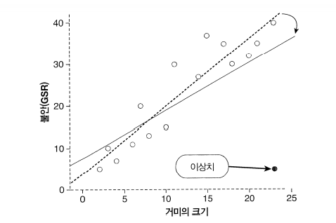
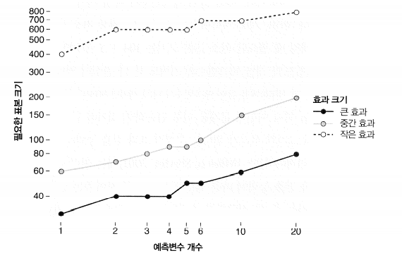
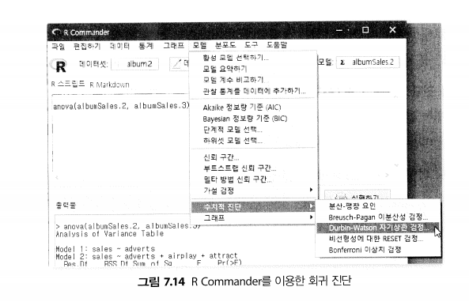
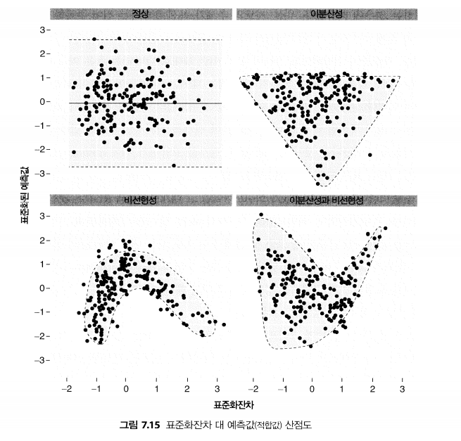
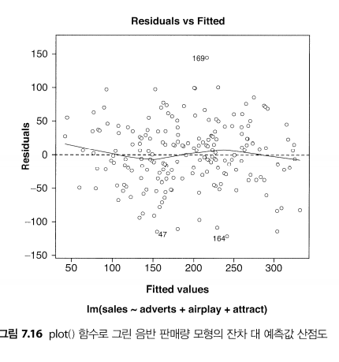
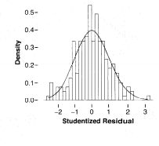
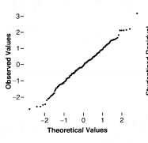
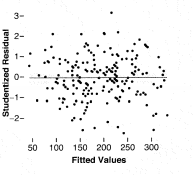
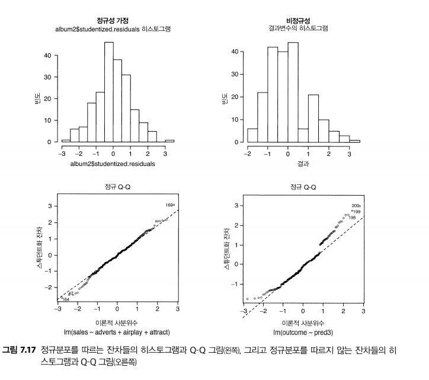

```{r setup, include=FALSE}
knitr::opts_chunk$set(echo = TRUE)
```

## 7.7 회귀모형의 정확도 평가

- 자료 표본에 기초에서 모형을 만들었다면, 두 가지 중요한 질문을 던져보아야 한다. 첫째로, 모형이 자료에 잘 적합는가? 또는, 적은 수의 사례들에 영향을 받는가? 둘째로, 모형이 다른 표본들로도 일반화되는가? 이 질문들은 모형을 어떻게 활용하는가에 영향을 미친다는 점에서 필수적이다.

- 일반화(generaliztion)는 중요한 추가 단계이며, 만일 모형이 잘 일반화되지 않는다면, 그 모형은 오직 모형을 만드는데 사용한 표본에 관한 어떤 결론을 이끌어내는 데만 사용해야 한다.


# 7.7.1.1 이상치와 잔차

- 이상치는 자료의 주된 추세와는 크게 다른 사례를 말한다. 그림 7.9에 회귀분석에서의 이상치의 예가 나와 있다. 이상치가 있으면 모형이 한쪽으로 치우치게 된다. 이는 이상치들의 회계계수 추정값들에 영향을 주기 때문이다.



*그림 7.9 이상치의 영향을 보여주는 그래프.점선은 원래 자료의 회귀선(그림7.3)이고 실선은 한 사례를 이상치로 바꾼후 회귀선이다.

## 7.7.1.2 영향력이 큰 사례들

- 모형의 잔차를 보고 이상치들은 찾아서 점검히는데 것 외에, 모형의 매개변수들에 지나치게 큰 영향을 주는 사례들을 살펴보는 것도 가능하다.

- 특정하나의 사례의 영향력을 평가하는데 사용할 수 있는 잔차 통계량이 몇가지 있다.
그중 하나는 수정 예측값인데, 이것은 해당 사례를 제외한 자료로 만든 모향이 예측한 값이다. 만일 해당 사례가 사실은 모형에 그리 큰 영향을 미치지 않았다면,수정 예측값은 원래의 예측값과 아주 비슷할 것이다.


## 7.7.1.3진단 통계랑 관한 마지막 한 마디

- 회귀분석 후에 조사해야 할 진단 통계랑(diagmositc statistic)은 많이 있다. 그러한 다양한 수치로 부터 하나의 간결한 결론을 이끌어내기란 쉽지 않은 일이다.
- 이와 관련해서 강조하고 싶은 것은 지적했듯이 이러한 절차들에 내재한 위험성을 조심해야 하다는것이다.


## 7.7.2 회귀모형의 평가 II: 일반화

- 회귀분석을 실행하면 표본의 관측값들은 정확히 예측하는 회귀 방정식이 나온다.
그러나 사회과학에서는 그러한 모형을 일반화함으로써 표본 이상의 것에 관한 뭔가를 알아내려고 하는 경우가 많다.

## 7.7.2.1 가정 점검
- 한 표본으로 얻은 모형으로 어떤 모집단에 관한 결론을 얻으려먼 다음과 같은 여러 가정이 성립해야한다.

- 변수의 종류: 모든 예측변수는 반드시 양적 변수 또는 범주형이어야 하고, 결과변수는 반드시 연속이자 비유계(unbounded)인 양적 변수이어야 한다.

-0이 아닌 분산 : 예측변수의 분산0이 아니어야 한다.

- 완전 다중공선성의 부재: 둘 이상의 예측변수 사이에 완전한 선형 관계가 없어야 한다.
즉, 예측변수들의 상관계수가 너무 높아서는 안된다.


## 7.7.2.3회귀에서 표본 크기의 중요성

- 이와 관련한 일반 법칙은 여러가지 인데, 널리 쓰이는 두 가지는 모형의 예측변수당 사례 10개를 수집한다는 법칙과 사례15개를 수집한다는 법칙이다. 예를 들어 예측변수가 다섯개이면, 적용하는 법칙에 
따라 사례를 50개 또는 75개 모아아한다.


## 7.7.2.4 공선성
- 다중공선성은 회귀모형에 있는 둘 이상의 예측변수들은 사이에 강한 상관관계가 존재하는 것을 말한다. 당연한 말이겠지만, 공선성은 다중회귀에서만 문제가 된다. 

- 완전공선성이 존재한다고 말한다(가장 간단한 예는 두 예측변수의 관계가 완전 상관,즉 상관계수가 1인 경우이다.)



* 그림 7.10 회귀분석에 예측변수 개수와 검출할 효과크기에 따른 필수 표본 크기들을 보여주는 그래프

- b들을 믿을 수 없게 된다: 공선성이 높아지면 b 개수들의 표준오차도 커진다. 표준오차의 의미를 생각해보면, b 계수의 표준오차가 커진다는 것은 표본에 따른 b의 변동이 커진다는 뜻임을 알 수 있을 것이다.

- R의 크기가 제한된다: R은 예측변수들과 결과변수 사이의 다중상관을 측정한 값이고
$R^{2}$은 결과의 변동을 예측변수들이 어느 정도나 설명하는지를 나타낸 값임을 기억할 것이다. 

- 예측변수들의 중요도 평가가 어렵다: 예측변수들 사이에 다중공선성이 존재하면 개별 예측변수의 중요도를 평가하기가 어려워진다.

# 7.9 회귀모형의 정확도 검정
* 7.9.1 R Commander를 이용한 진단 검정

- R Commander로 다양한 종류의 진단 검정을 실행할 수 있고, 모형을 여러 가지로 수정할 수 도 있다. 해당 기능들은 모두 모델 메뉴를 통해서 접근한다 (그림 7.14). 다음은 이 메뉴의 주요하위메뉴를 간단히 설명한 것이다.



- 활성 모텔 선택하기: 이 메뉴는 정보를 얻고자 하는 회귀모형을 선택하는 데 쓰인다.

- 모텔 요약하기: 이 메뉴는 현재 활성화된 모형의 요약 정보를 제공한다(summary() 함수가 제공하는 것과 같은 내용이다.)


## 7.9.5 잔차에 관한 여러 가정의 점검

- 분석을 마무리하는 차원에서, 잔차(오차)에 관한 가정들을 눈으로 점검해 볼 필요가 있다.
기본적인 분석에는 예측값들(x 축)에 대한 표준화잔차들(y 축)의 산점도를 그려 보면 도움이 된다. 그러한 그래프를 살펴보면 오차의 무작위성과 등분산성을 눈으로 확인할 수 있기 때문이다. 

- 출판을 위한 고품질 그래프를 만들고 싶다면 ggplot2패키지를 사용하는것이 좋다.

- 지금처럼 그냥 가정들을 확인하는 목적이라면 더 간단한(그러나 덜 예쁜) 내장 함수 plot()과 hist()로 충분한다.






*출판 품질 그래프*

- 이 예측값을 담은 fitted 라는 변수가 원래의 데이터프레임을 새로 생겼다. 그리고 앞에서 데이터프레임에 스튜던트화 잔차들은 담은 studentized.residuals라는 변수를 추가했음 을 기억할 것이다.

```
histogram<-ggplot(album2, aes(studentized.residuals)) + opts(legend.position =
"none") + geom_histogram(aes(y = ..density..), colour = "black", fill = "white") +
labs(x = "Studentized Residual", y = "Density")
histogram + stat_function(fun = dnorm, args = list(mean = mean(album2$studentized.
residuals, na.rm = TRUE), sd = sd(album2$studentized.residuals, na.rm = TRUE)), colour
= "red", size = 1)
```

-Q-Q그림을 만들려면 다음 명령을 실행하면된다.

```
qqplot.resid <- qplot(sample = album2$studentized.residuals, stat="qq") + labs(x =
"Theoretical Values", y = "Observed Values")


```

- 마지막으로 , 다음 명령들을 실행하면 스튜던트화 잔차 대 예측값의 산점도가 만들어진다.

```
scatter <- ggplot(album2, aes(fitted, studentized.residuals))
scatter + geom_point() + geom_smooth(method = "lm", colour = "Blue")+ labs(x = "Fitted
Values", y = "Studentized Residual")
```
다음은 이들로 생성한 그래프들이다.

  

- 그림 7.17에 현재 자료의 히스토그램이 나와 있다. 히스토그램이 정규분포 형태(종 모양 곡선)에 가까울수록 좋은 것인데, 실제로 음반 판매량 자료의 히스토그램은 대략 정규분포의 모습을 띠고 있다.



## 7.9.6 가정이 깨졌다면

- 모형이 자료에 완벽하게 잘 맞는다면(이상치도 없고, 영향력이 큰 사례도 없고 등등), 비록 가정들이 깨졌다고 해도 그모형을 이용용해서 표본에 대한 어떤 결론을 이끌어 낼 수 있다. 그러나 회귀모형은 표본이상으로 일반화할 때 휠씬 더 유용하며, 그런 경우에는 가정이 중요해진다.


