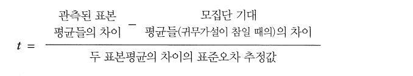
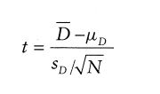
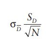
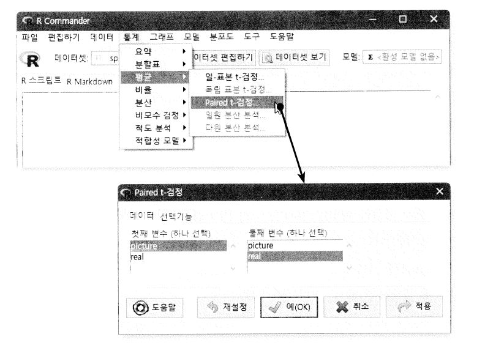

```{r setup, include=FALSE}
knitr::opts_chunk$set(echo = TRUE)
```
# 제 9장 두 평균의 비교

## 9.1 이번 장에서 배우는 내용
이 책의 서론에서 설명하고자 하는 것은 두 가지를 비교해서 하나가 다른 하나와 다른지에 대한 증거를 찾는 것.  
즉, 평균에 대해서 이야기 하는 것.


## 9.2 이번 장에서 사용하는 패키지, 용어와 함수


# 9.3 차이 살펴보기
차이를 살펴본다면 그룹들 사이의 차이에 관심을 가지는 것이다. 즉, 두 그룹의 평균을 비교하는 것이다.  
  1. 서로다른 여러 그룹에 각각 다른 실험적 조작을 가하는 것(그룹간 설계 또는 독립설계)  
  2.하나의 그룹에 서로 다른 시점에서 여러 실험적 조작을 가하는 것(반복측정 설계)  
  
  종종 사람들은 인위적으로 만들어 낸 그룹들을 비교하는 유혹에 빠지지만(**회귀식**) 일반적으로 그런 방식은 바람직 하지 않다.

## 9.3.1 예제
```
이 예제는 거미 공포증이 진짜 거미(real)에 한정되는지 아니면 거미 사진(picture)만 봐도 비슷한 수준의 불안을 느끼는지에 관한 것이다
```

## 9.3.2 단계 1 : 각 실험 참가자의 평균 계산
 1. 반복측정 오차 막대들을 보정하는 과정은 여러 단계로 이루어진다.
 2. 참가자의 평균 불안도를 계산한다.
 3. 두 개의 열의 합을 구한 다음 2로 나누면 된다.
 
 
```
spiderWide$pMean <- (spiderWide$picture + spiderWide$real) / 2
```

## 9.3.3 단계 2 : 총평균 계산
 1. 총평균(grand mean)은 모든 점수의 평균이다.
 2. 총평균을 구하려면 익숙한 c()함수를 이용해서 picture 변수와 real 변수를 하나로 병합한 결과에 대해 mean()을 적용하면 된다.
 ```
grandMean <- mean(c(spiderWide$picture, spiderWide$real))
```

## 9.3.4 단계 3 : 조정인자 계산
 - 평균들을 평준화하여 각 조건의 점수들을, 조건들 사이의 평균을 취할 때처럼 조정한다.
```
spiderWide$adj <- grandMean – spiderWide$pMean
```

## 9.3.5 단계 4 : 조정인자로 각 값을 조정
 - 기존 점수(picture)에 조정인자(adj)를 더하면 된다.
```
spiderWide$picture_adj <- spiderWide$picture + spiderWide$adj
```


# 9.4 t검정  
 1. 상관계수가 0과 다른지 검사할 때 사용
 2. 회귀계수 b가 0과 다른지 검사할 때 사용
 3. 두 그룹 평균이 다른지 검사 할 때 사용  
 
*예시*

 
 
 [출처 : 네이버블로그,담스토리]
 
 
* **독립 t 검정** : 이 검정은 실험 조건이 둘이고 각 조건에 서로 다른 참가자들을 배정한 실험에 쓰인다.
( = 독립평균t검정, 독립측도t검정, 독립표본t검정 이라고 부르기도 한다.)

* **종속 t 검정** : 이 검정은 실험 조건이 둘이고 두 조건 모두에 같은 참가자들을 배정한 실험에 쓰인다.
( = 종속평균t검정, 대응t검정, 짝표본t검정 이라고 부르기도 한다.)

### 9.4.1 t검정의 이론적 근거
두 t검정 모두 비슷한 이론적 근거를 가진다. 요약하자면 다음과 같다.

 - 두 가지 자료 표본을 수집해서 두 표본평균을 계산한다. 그 평균들은 크게 다를 수도 있고 조금만 다를 수도 있다.
 
 - 만일 두 표본이 같은 모집단에서 추출한 것이라면 두 평균이 대략 같을 것이다. 두 평균이 다른 것이 순전히 우연일 수도 있지만 두 표본평균이 우연히 아주 다른 경우는 아주 드물 것이라고 기대한다. 귀무가설에 의해, 실험 조작이 참가자들에게 아무런 효과가 없다고 가정한다. 따라서 표본평균들이 아주 비슷할 것이라고 기대한다.
 
 - 수집한 표본평균들의 차이를, 만일 효과가 없었다면(즉, 귀무가설이 참이라면) 얻었을 표본 평균들의 차이와 비교한다. 표준오차가 크다는 것은 표본평균들 사이의 차이가 크게 나올 가능성이 크다는 뜻이다. 만일 수집한 평균들의 차이가 표준오차에 근거해서 기대할 수 있는 차이보다 크다면, 다음 두 가지 설명이 가능하다.
 
  1. 모집단에 효과가 존재하지 않으며, 모집단의 표본평균들의 변동이 아주 심하다. 수집된 두 표본의 평균이 많이 다른 것은 우연일 뿐이다.
  2. 두 표본이 서로 다른 모집단에서 비롯된 것이다. 그리고 각 표본은 해당 모집단의 전형적이 특징을 반영한다. 이 시나리오에서 두 표본평균의 차이는 두 표본의 진짜 차이를 대표한다.(따라서 귀무가설이 틀렸다.)
- 표본평균들 사이의 관측된 차이가 커짐에 따라 두 번째 설명이 옳다는 확신이 강해진다. 만일 귀무가설이 틀렸다면 두 표본에 각각 다른 실험 조작이 가해졌기 때문에 두 표본평균이 다르게 나왔다는 확신이 강해진다.

- 이상의 논의를 반영한 t검정통계량 계산공식  
$t = \frac{관측된표본 평균들의차이 - 모집단 기대 평균들(귀무가설이 참일 때의)의 차이}{두 표본평균의 차이의 표준오차 추정값}$
-> 이 공식에서 분자는 '모형'이다 

## 9.4.2 일반선형모형으로서의 t검정

7장 회귀계수 

* 결과~i~ = (모형) + 오차~i~

선형모형을 사용할 때 이 일반 공식은 모형이 직선의 기울기와 절편으로 정의되는 식과 아주 비슷한 공식이다.


A~i~=(b~0~+b~1~G~i~)+ε~i~  
불안~i~=(b~0~+b~1~그룹~i~)+ε~i~

여기서, A는 anxiety, G는 group(독립변수), A~i~는 결과, b~0~는 절편, b~1~는 예측변수의 가중치이다.


# 9.5 독립t검정

## 9.5.1 독립 t검정 공식의 설명
서로 다른 실험 조건에서 서로 다른 개체들을 검사할 때 사용하는 독립 t검정부터 살펴보기로 하자.

t 통계량들은 모형 또는 효과를 오차에 견주어 비교한 것에 해당한다. 서로 다른 조건에서 서로 다른 참가자들을 실험했을 때 점수 쌍들은 실험 조작뿐만 아니라 다른 변수(참가자의 동기, IQ같은 개인차 등)에 의해서도 차이가 생긴다. 따라서 조건별로 비교를 수행해야 한다.

이 공식에서 보듯이, 이 검정에서는 점수 쌍들의 차이를 살펴보는 것이 아니라 두 표본평균의 차이를 두 모집단에서 얻을 것이라고 기대하는 평균들의 차이와 비교한다. 만일 귀무가설이 참이라면 두 표본은 같은 모집단에서 비롯된 것이라 할 수 있다. 귀무가설 하에서는 µ~1~ =  µ~2~ 이므로 µ~1~ − µ~2~ = 0 이다. 따라서 귀무가설 하에서 식 (9.3)은 다음과 같이 좀 더 간단해진다.


독립 t검정에서는 그룹 간 차이에 주목하므로, 그룹 간 차이의 표준편차가 분모로 쓰인다. 여기에 표집분포의 논리가 적용된다. 서로 다른 두 모집단에서 뽑은 두 개의 표본으로 이루어진 표본 쌍들이 여러 개 있고, 각 쌍의 두 표본평균을 비교한다고 상상해 보자. 이전에 표집분포를 설명할 때 말했듯이, 한 모집단에서 수집한 표본들은 대부분 평균이 비슷하다고 기대할 수 있다. 따라서 여러 표본 쌍들을 조사해 보면, 그 표본평균 차이가 대체로 비슷할 것이다. 그러나 표본 평균 차이가 다른 차이들보다 조금 벗어나는 쌍들도 종종 있을 것이며, 아주 가끔은 크게 벗어나기도 할 것이다. 만일 두 모집단에서 취할 수 있는 모든 표본 쌍의 표본평균 차이들의 표집분포를 그래프로 그릴 수 있다면, 그 차이들이 정규분포를 따른다는 점과 그 정규분포의 평균이 모집단 평균들의 차이(µ~1~ − µ~2~)와 같다는 점을 알게 될 것이다. 이때 표집분포는 두 개의(또는 그 이상의) 표본들의 평균들이 어느 정도나 차이가 날 것인지 말해준다. 그리고 표집분포의 표준편차는 순전히 우연에 의해 생긴 표본평균 차이들의 변동 정도를 말해준다. 만일 그 표준편차가 작다면 표본평균들의 차이가 작을 것이라고 기대할 수 있다. 따라서, 표집분포의 표준오차를 두 표본평균의 차이가 통계적으로 유의한지 아니면 단지 우연에 의한 것인지 평가하는 측도로 사용하는 것이 합당하다. 구체적으로 말하면, 표본평균 차이를 표집분포의 표준편차로 나눈 값을 그러한 측도로 사용한다.
그렇다면, 표본평균 차이들의 표집분포의 표준편차를 어떻게 구해야 할까? 이때 분산 합 법칙이 쓰인다. 이 법칙에 따르면, 두 독립변수의 차이의 분산은 두 독립변수의 분산의 합과 같다.
다음 공식을 이용하면 표본 표준편차를 이용해서 각 모집단의 표집분포의 표준오차(SE)를 계산할 수 있다.


그런데 분산이라는 것은 그냥 표준 편차의 제곱이다. 따라서, 표집분포의 분산은 다음과 같이 계산하면 된다.


분산 합 법칙에 따르면, 차이들의 표집분포의 분산을 구하려면 그냥 두 모집단의 표집분포 분산들을 합하면 된다.


그리고 차이들의 표집분포의 표준오차는 그냥 이 분산의 제곱근이다(분산이 표준편차의 제곱이므로).


이상을 식(9.4)에 대입하면 다음이 나온다.


식 (9.5)는 표본 크기들이 같을 때만 성립한다. 참가자들의 수가 같지 않은 두 그룹을 비교해야 할 때는 식 (9.5)가 적합하지 않다. 그런 경우에는 통계량의 합동분산 추정값 t검정을 사용해야 한다. 이 검정에서는 각 표본의 분산에 가중치를 부여함으로써 표본 크기의 차이를 보정한다. 큰 표본이 작은 표본보다 낫다는 점에 착안해서, 합동분산 추정값 t검정에서는 표본의 크기를 가중치로 삼아서 각 표본 분산에 곱한다(좀 더 구체적으로는 자유도, 즉 표본 크기 빼기 1을 가중치로 사용한다). 정리하자면, 합동분산 추정값을 계산하는 공식은 다음과 같다.


이것은 두 분산에 각각 해당 자유도(가중치)를 곱해서 합한 후 가중치들의 합으로 나눈 것이다. 간단히 말하면 이는 두 분산의 가중평균이다. 이렇게 구한 가중평균 분산을 원래의 t검정공식에 대입하면 다음이 나온다.


이렇게 계산한 t값을 같은 자유도의 t분포에서 순전히 우연으로 얻을 수 있는 최대값과 비교한다. 만일 계산한 t값이 표의 임계값보다 크다면, 독립변수의 효과가 반영된 것이라고 확신할 수 있다. t계산 공식에서 한 가지 명백한 것은, 이 값을 계산하는 데에는 원본 자료가 전혀 필요하지 않다는 것이다. 평균들과 표준편차들, 그리고 표본 크기들만 있으면 된다.
t통계량을 계산하는 과정을 꽤 자세하게 설명했는데, 이는 단지 R에서 t검정을 수행할 때 내부적으로 어떤 일이 일어나는지 이해하는 데 도움을 주려는 것일 뿐이다. 만일 이상의 내용이 잘 이해되지 않아도 걱정할 필요는 없다. 어차피 실제로 계산은 R이 수행하며, 우리에게 꼭 필요한 것은 그 결과이기 떄문이다.

## 9.5.2.1 일반적인 독립 t검정 절차  

 1.자료를 입력한다.  
 2.자료를 탐색한다: 다른 분석들에서처럼, 먼저 자료를 그래프로 그려 보고, 몇 가지 기술통계량들을 계산해 보는 것이 좋다. 또한, 분포의 가정들도 점검해야 한다(제5장 참고).  
 3.검정통계량을 계산한다: 이제 t검정을 실행한다. 이전 단계의 결과에 따라서는 강건한 버전의 검정을 실행해야 할 수도 있다.  
 4.효과크기를 계산한다: 효과를 효과크기로 수량화하는 것이 유용하다.

## R의 영혼의 조언 9.2 평균, 표준편차, 표본 크기만으로 t값 계산
R에서 두 그룹의 평균과 표준편차, 표본 크기만으로 t검정통계량을 계산할 수 있다. 우선, 그룹 1의 평균(x1)과 그룹 2의 평균(x2), 그룹 1의 표준편차(sd1)와 그룹 2의 표준편차(sd2), 그리고 그룹 1의 표본 크기(n1)와 그룹 2의 표본 크기(n2)를 계산한다.  

```r
x1 <- mean(spiderLong[spiderLong$Group=="RealSpider",]$Anxiety)  

x2 <- mean(spiderLong[spiderLong$Group=="Picture",]$Anxiety)  

sd1 <- sd(spiderLong[spiderLong$Group=="Real Spider",]$Anxiety)  

sd2 <- sd(spiderLong[spiderLong$Group=="Picture",]$Anxiety)  

n1 <- length(spiderLong[spiderLong$Group=="Real Spider",]$Anxiety)  

n2 <- length(spiderLong[spiderLong$Group=="Picture",]$Anxiety)
```

다음으로, 이들을 이용해서 t검정통계량을 계산하는 함수를 정의한다 

```r
ttestfromMeans<-function(x1, x2, sd1, sd2, n1, n2)  
{
df<-n1 + n2 - 2
poolvar<-(((n1-1)*sd1^2)+((n2-1)*sd2^2))/df
t<-(x1-x2)/sqrt(poolvar*((1/n1)+(1/n2)))
sig<-2*(1-(pt(abs(t),df)))
paste("t(df = ", df, ") = ", t, ", p = ", sig, sep = "")
}
```

이 명령들을 실행하면 두 그룹의 평균, 표주년차, 표본 크기를 받아서 두 평균의 비교에 대한 t검정 결과를 출력하는  ttestfromMeans라는 함수가 생성된다. 함수의 본문을 차례로 살펴보자.


  
이제 앞에서 계산한 평균, 표준편차, 표본 크기들로 이 함수를 실행한다.

ttestfromMeans(x1, x2, sd1, sd2, n1, n2)

그러면 실제 자료로 계산했을 떄와 같은 결과가 나온다.

[1] "t(df = 22) = 1.68134561495341, p = 0.106839192382597“

## 9.5.2.2 자료 입력
t.test() 함수를 사용할 때는 자료의 형식이 별문제가 되지 않는다는 점이다. 긴 형식의 자료도 잘 처리하고 넓은 형식의 자료도 잘 처리한다.

Group<-gl(2, 12, labels = c( "Picture", "Real Spider"))
Anxiety<-c(30, 35, 45, 40, 50, 35, 55, 25, 30, 45, 40, 50, 40, 35, 50, 55,
65, 55, 50, 35, 30, 50, 60, 39)


## 9.5.2.4 자료 탐색과 가정 점검
제4장에서 보왔듯이, 항상 자료를 그래프로 그려서 살펴보는 것이 바람직하다. 지금 예에서는 오차 막대가 있는 그래프들을 그려보기로 한다.


## 9.5.2.5 R을 이용한 독립 t검정
t검정을 수행하는 함수는 t.test()이다. 이함수를 사용하는 방법은 그룹들의 자료가 하나의 열에 들어 있는지(spiderLong.dat 처럼) 아니면 서로 다른 두 열에 들어 있는지(spiderWide.dat처럼)에 따라 달라진다. 두 룹의 자료가 하나의 열에 들어 있을떄는 t.test() 함수를 마치 lm()함수처럼 사용한다. 

세모형<-t.test(결과변수 ~ 예측변수, data = 데이터프레임, paired = FALSE 또는 TRUE)  
  
- 세모형은 함수가 생성한, 모형에 관한 정보를 담은 객체이다. 이후 summary(새모형) 형태의 명령을 실행하면 모형의 구체적인 매개변수들을 확인할 수 있다.
- 결과변수는 결과 측도의 점수들을 담은 변수이다.
- 예측변수는 점수가 속한 그룹을 말해주는 변수이다.
- 데이터프레임은 위의 변수들이 있는 데이터프레임이다.
- paired는 검정의 종류를 결정한다. paired = TRUE를 저정하면 짝표본 t검정, 즉 종속 t검정이 적용되고. paired = FALSE를 지정하거나 이 옵션을 아예 생략하면 기본 선택인 독립 t검정이 적용된다.

한편, 두 그룹의 자료가 각각 다른 열에 들어 있을 때는 t.test() 함수를 다음과 같은 형태로 사용한다.

새모형<-t.test(점수 그룹 1, 점수 그룹 2, paired = FALSE/TRUE)

앞에서와 다른 옵션들만 설명하자면  

- 점수 그룹1은 첫 그룹의 점수들을 담고 있는 변수이고.  
- 점수 그룹2는 둘째 그룹의 점수들을 담고 있는 변수이다.

두 형태 모두, 다음과 같은 추가 옵션들이 존재한다. 기본값이 마음에 들지 않는 옵션이 있다면 해당 옵션을 명시적으로 지정하면 된다. 기본값은 양쪽꼬리 검정이다 

 - alternative = “two.sided”/“less”/“greater”: 이 옵션은 양쪽꼬리 검정을 사용할 것인지, 아니라면 가설이 어떤 방향 인지를 결정한다. 기본값은 양쪽꼬리 검정이다(alternative = “two.sided”를 지정하거나 아예 생략). 한쪽꼬리 검정을 사용할 때는 alternative = “less”(평균들의 차이가 0보다 작다고 예측하는 경우) 또는 alternative = “greater”(평균들의 차이가 0보다 크다고 예측하는 경우)를 지정해야 한다.  
 - mu = 0: 평균들의 차이가 0이라는 것이 귀무가설이지만, 원한다면 이를 바꿀 수 있다. 예를들어 mu = 3을 지정하면 평균들의 차이가 3이라는 것을 귀무가설로 삼아서 검정을 실행한다.  

- var.equal: 기본적으로 함수는 분산들이 같지 않다고(var.equal = FALSE) 가정한다. 그러나 어떤 이유로 분산들이 같다고 가정한다면(실제로 그럴 이유는 없겠지만), var.equal = TRUE를 지정하면 된다.  
- conf.level = 0.95: 이 옵션은 p값과 신뢰구간의 유의 수준을 결정한다. 기본값은 0.95 (95% 신뢰구간에 해당)이며, 대부분의 경우 이 기본값으로 충분하므로 이 옵션을 아예 생략하면 된다. 그러나 예를 들어 99% 신뢰구간을 원하다면 conf.level = 0.99를 지정하면 된다.  
 - na.action: 자료가 완결적이면 이 옵션은 무시해도 된다. 그러나 자료에 결측값이 존재하면 (즉 데이터프레임에 NA들이 있으면), na.action = na.exclude를 지정해서 결측값이 있는 모든 사례를 제외하는 것이 유용할 것이다.
 
그럼 spiderLong 데이터프레임에 대해 독립 t검정을 실행해 보자. 이 데이터프레임은 다음과 같은 모습이다.


다음은 이에 대해 t검정을 실행하는 명령들이다.
```r
ind.t.test<-t.test(Anxiety ~ Group, data = spiderLong)
ind.t.test
```

첫 명령은 spiderWide 데이터프레임의 real 변수와 picture 변수에 대한 검정을 수행하고 그 결과를 담은 ind.t.test라는 객체를 생성한다. 둘째 명령은 그 객체의 내용을 출력한다.


다음은 이에 대해 t검정을 실행하는 명령들이다.

```r
ind.t.test<-t.test(spiderWide$real, spiderWide$picture
ind.t.test
```

첫 명령은 spiderWide 데이터프레임의 real 변수와 picture 변수에 대한 검정을 수행하고 그 결과를 담은 ind.t.test라는 객체를 생성한다.  
둘째 명령은 그 객체의 내용을 출력한다.


## 9.5.2.1 일반적인 독립 t검정 절차
자료의 형식이나 구체적인 t.test() 함수 실행 명령과는 무관하게, 검정 결과는 본질적으로 동일하다. 출력 9.3에 결과가 나와 있다. 출력의 첫 부분에는 t 값과 자유도(df), 그리고 p 값이 나와 있다. p 값이 .05보다 크므로, 그룹 평균들이 다르지 않다는 귀무가설을 기각할 수 없다. 9.4.2에서 선형모형으로 분석을 실행했을 때는 t 값이 p값과 같았음을 기억할 것이다. 그러나 이번에는 두 값이 다르다. 그리고 p 값 자체도 이전의 p 값과 조금 다른데, 이는 이분산성 때문에 자유도를 조정했기 때문이다.
그 다음에 나온 신뢰구간의 하계와 상계는 95%의 경우에서 평균들의 진짜 차이가 포함되리라고 기대하는 차이 범위를 정의한다. 지금 예에서 그 범위는 –15.6에서 +1.65이다. 따라서 진짜 차이가 될 수 있는 값들의 범위가 상당히 넓다. 마지막으로. 출력에는 두 그룹의 평균인 40과 47도 나와 있다.
그런데 자유도 값이 좀 이상해 보일 것이다. 앞에서 자유도는 두 표본 크기의 합에서 표본개수 2를 뺀 것이라고 했다. 즉, df = N1 + N2 − 2 = 12 + 12 − 2 = 22이어야 한다. 그러나 출력에는 21.39라는 값이 나와 있다. 이러한 차이는 이 함수가 웰치의 t검정을 사용하기 때문에 생긴 것이다. 이 검정은 분산의 동질성을 가정하지 않는다. 대신 이 검정은 분산의 동질성에 기초해서 자유도를 조금 조정한다. 그래서 자유도가 우리가 기대했던 22가 아니라 21.39가 된 것이다. 이러한 차이는 p 값에도 영향을 미쳤다. 이전에는 prkqtdl 0.1068이었지만, 이번에는 0.1072이다. 물론, 보고를 위해 소수점 이하 세 자리로 반올림하면 둘 다 .107이 된다. 표본 크기가 같을 때는 이러한 조정이 결과에 큰 영향을 미치지 않는다.


## 9.5.2.7 독립 평균들의 강건한 비교 방법
이번 절에서는 월콕스가 작성한 R 함수들을 실행할 것이며 이 함수들은 서로 다른 그룹의 자료가 각자 다른 열에 들어 있다고 기대한다. 가장 먼저 살펴볼 강건한 함수는 절사평균에 기초한 yuen()이다. 이 함수의 일반적인 활용 형태는 다음과 같다.

yuen(점수 그룹 1, 점수 그룹 2, tr = .2, alpha = .05)

여기서  

- 점수 그룹 1은 첫 그룹의 점수들을 담고 있는 변수이고
- 점수 그룹 2는 둘째 그룹의 점수들을 담고 있는 변수이다
- tr은 평균을 깍는 비율이다. 기본은 .2 즉 20%이다. 이 옵션은 20% 이외의 값을 사용할 떄만 지정하면 된다
- alpha는 검정의 유의 수준을 설정한다. 이 옵션은 통상적으로 쓰이는 .05 이외의 값을 사용할 때만 지정하면 된다.

따라서, 독립 평균들을 20% 깍아서 95% 수준으로 검정을 실행하려면 다음처럼 두 변수만 지정하면 된다.

yuen(spiderWide$real, spiderWide$picture)

10%만 깍는다면 다음처럼 해당 옵션을 명시적으로 지정해야 한다.

yuen(spiderWide$real, spiderWide$picture, tr = .1)

이 명령의 결과가 출력 9.4에 나와 있다. 이 강건한 검정의 결과에 따르면, 두 거미 공포증 그룹의 점수들에는 유의한 차이가 없다. T~y~(13.91) = 1.296, p = .216이다.

yuenbt() 함수를 이용하면 부트스트랩 방법을 적용해서 절사평균들을 비교할 수 있다. 이 함수의 일반적인 활용 형태는 다음과 같다.

yuenbt(점수 그룹 1, 점수 그룹 2, tr = .2, nboot = 599, alpha = .05, side = F)

yuen()과는 다른 옵션들만 설명하겠다.

- nboot = 599: 이 옵션은 사용할 부트스트랩 표본들의 개수이다. 이 옵션을 생략하면 기본값이 599가 쓰인다. 필요하다면 더 늘려도 된다(그러나 부트스트랩 표본을 200개 이상 사용할 필요는 없을 것이다).
- side = F: 기본적으로 이 함수는 신뢰구간들에도 부트스트랩을 적용한다. 따라서 신뢰구간이 비대칭이 될 수 있다. 신뢰구간들이 반드시 대칭이 되게 하고 싶다면 side = T를 지정하면 된다. 그러면 p값이 산출된다(기본적으로는 p값이 산출되지 않는다. 그렇더라도, 신뢰구간에 0이 포함되어 있는지의 여부로 유의성을 추론할 수 있다).

다음은 20% 절사한 독립평균들의 부트스트랩 검정을 수행하는 명령이다.

```r
yuenbt(spiderWide$real, spiderWide$picture, nboot = 2000)
```

이 명령의 결과가 출력 9.4에 나와 있다. 이 강건한 검정의 결과에 따르면, 두 거미 공포증 그룹의 불안 점수들에는 유의한 차이가 없다.  Y~t~ = 1.19 (−5.40, 17.87).


마지막으로, 부트스트랩과 M 추정량으로 검정을 수행하는 pb2gen() 함수를 보자. 이 함수의 일반적인 활용 형태는 다음과 같다.

```r
pb2gen(점수 그룹 1, 점수 그룹 2, alpha=.05, nboot=2000, est = mom)
```

옵션들은 추정량 함수를 선택하는 est만 빼고는 yuenbt()와 같다. 기본 설정인 mom으로 충분하므로 est 옵션은 생략해도 된다. 다음은 거미 공포증 자료에 대해 부트스트랩 독립 M추정량 검정을 수행하는 명령이다.

```r
pb2gen(spiderWide$real, spiderWide$picture, nboot=2000)
```

이 명령의 결과가 출력 9.4에 나와 있다. 이 강건한 검정의 결과에 ᄄᆞ르면, 두 거미 공포증 그룹의 불안 점수 차이는 유의하지 않다(p = .16이고 신뢰구간에는 0이 포함되어 있으므로). 정리하자면, 세 강건한 검정 모두 거미 공포증 자극의 종ㅈ류가 불안에 영향을 미치지 않음을 제시한다.

## 9.5.2.8 효과크기 계산
비록 t 통계량이 통계적으로 유의하지 않다고 해도, 반드시 효과가 실용적인 관점에서 중요하지 않다는 뜻은 아니다. 효과가 실질적인지 파악하려면 효과크기를 이용해야 한다. 효과크기의 측도는 여러 가지이지만, 여기서는 널리 알려지고 자주 쓰이는 r을 사용하기로 하겠다. t값을 r값으로 변환하는 것은 아주 쉽다. 그냥 다음 공식을 사용하면 된다.


  
앞에서 R로 계산한 t값과 df 값을 이 공식에 대입하면 다음이 나온다.


   
r 계산을 R에게 시키는 것도 물론 가능하다. t 값은 t.test() 검정 결과를 담은 객체의 statistic[[1]]이라는 변수에 들어 있고, 자유도는 parameter[[1]]이라는 변수에 들어 있다. 앞에서 t 검정의 결과를 ind.t.test라는 객체에 저장했으므로, 이들에 접근하려면 그 객체의 이름 다음에 $ 기호를 써주고 변수 이름을 써주면 된다. 다음은 거미 공포증 자료에 대한 독립 t 검정의 t 값을 담은 t라는 변수를 생성하는 명령이다.  

```r
t<-ind.t.test$statistic[[1]]
```

마찬가지로, 다음은 해당 자유도를 담은 df라는 변수를 생성하는 명령이다.

```r
df<-ind.t.test$parameter[[1]]
```

이제 이들을 이용해서 r 값을 계산한다.

```r
r <- sqrt(t^2/(t^2+df))
```

이 명령은 앞에 나온 공식을 R의 언어로 표현한 것이다. 이 명령에 의해, r값을 담은 r이라는 변수가 생성된다. 변수 이름을 명령으로 사용하면 그 변수의 내용을 볼 수 있다. 또는, 다음처럼 round() 함수를 이용해서 수치를 적절히 반올림한 결과를 출력할 수도 있다.

```r
round(r, 3)
```

손으로 직접 계산했을 때와 같은 결과 (r = .342)가 나올 것이다. 제2장에서 이야기한 효과크기평가 기준들을 생각하면, 이 효과크기는 중간 효과에 해당한다. 따라서, 비록 통계적으로 유의하지는 않지만, 이 효과는 꽤 실질적인 효과에 해당한다.

## 9.5.2.9 독립 t검정의 보고
어떤 검정통계량이든, 상당히 표준적인 한 가지 보고 방식이 존재한다. 우선 검정과 관련된 발견을 진술하고, 그런 다음 검정통계량과 자유도, 그리고 그 검정통계량의 확률값을 명시하는 것이다. 또한, 최근에는 효과크기의 추정값을 보고하는 것이 권장된다. R의 출력을 보면 t 값은 –1.68이고 자유도는 21.39이다. 그리고 이 검정통계량은 p < .05로 유의하지 않다. 또한, 출력에는 각 그룳의 평균도 나와 있다. 이를 다음과 같이 보고하면 될 것이다.

```r
평균적으로 참가자들은 거미 사진을 보았을 때(M = 40.00, SE = 2.68)보다 진짜 거미를 보았을 때 더 많이 불안해했다(M = 47.00, SE = 3.18). 그 차이는 유의하지 않다(t(21.39) = -1.68, p > .05). 그렇긴 하지만, 그 차이는 중간 크기의 효과를 대표한다(r = .34).
```

검정 결과를 보고하면서 각 그룹의 평균과 표준오차도 이전처럼 보고했음을 주목하기 바란다. 검정통계량을 보고하는 부분은 이전의 예와 비숫하다. 단, 이번에는 p가 .05보다 작은(<) 것이 아니라 크다고(>) 보고해야 했다. 마지막으로, 효과크기도 언급했음을 주목하기 바란다.


# 9.6 종속t검정

한 그룹에서 다른 조건으로 실험을 하는 경우

식을


종속 t 검정에서 좀 더 구체화하면 다음과 같다.  


위의 식은 표본평균들의 차이(D)를 개대 모집단 평균들의 차이(µD)와 비교하되, 그 둘이 얼마나 다른지를 차이들의 표준오차(sD / N^0.5)를 고려해서 평가한다. 만일 귀무가설이 참이라면 모집단 평균들이 표본편균과 다르지 않을 것이라고(즉, µD = 0) 기대한다.

## 9.6.1 표집분포와 표준오차
표집분포의 성질

1. 만일 모집단이 정규분포이면 표집분포도 정규분포를 따를 가능성이 아주 크다.
  
2. 표본 크기가 크면(약 50개 이상) 그 표본은 정규본포를 따를 가능성이 아주 크다.

3. 표집분포의 평균은 모집단의 평균과 같으므로,평균적으로 표본평균은 모집단 평균과 아주 비슷하며, 표본평균이 모집단의 평균과 크게 다를 경우는 드물다.

4. 표집분포의 표준편차(차이의 표준오차)는 모집단의 표준편차를 표본의 관찰 개수의 제곱으로 나눈 것과 같다. 

5. 표준오차가 작다는 것은 한 모집단에서 추출한 표본 쌍의 평균이 비슷하다는 것을 의미하며, 반대로 표준오차가 크다는 것은 표본들 중 평균이 모집단 평균에서 상당히 벗어나 표본쌍의 평균차이가 꽤 클 수 있다는 뜻이다.

## 9.6.2 종속 t검정 공식의 설명1


D(평균차이):  

참가자마다 조거별 점수들의 차이를 계산하고 그 차이들의 총합이 나온다. 그 총합을 참가자 수로 나누면 평균차이가 나온다.  
평균 차이는 자료의 체계적 변동을 나타낸다.  

sD / N^0.5(표준오차): 표준오차는 모집단에 대한 모형으로서의 평균에 존재하는 오차의 측도이다. 만일 한 모집단에서 무작위로 두 개의 표본을 취했을 때, 두표본의 평균이 순전히 우연에 의해 다들 수 있다. 표준오차는 그 표본 평균들이 얼마나 다른가를 말해준다.

평균들의 차이를 비교할 때는 (조건별 평균 차이들의 평균)/(표준오차)를 사용하다.  
(1) 조건들 사이의 평균적인 차이를 표준화한다.  
(2) 표본들이 해당 모집단들을 얼마나 잘 번영하는지에 근거하여 평균들의 차이를 비교할 수 있다.

이상적인 경우, 모집단에서 가능한 모든 표본 쌍을 취해서 평균차이를 구하고, 그 차이들의 표준편파를 구해서 차이의 표준오차를 계산할 수 있다.  
그러나 현실적으로 표본에서 구한 차이들의 표준편차(sD)와 표본 크기(N)로 부터 표준오차를 추정한다.  
표준오차가 표준편차를 표본 크기의 제곱근으로 나눈 것처럼 차이 표준오차(σD)도 차이의 표준편차를 표본의 크기의 제곱근으로 나눈 것이다.


차이의 표준오차가 자료 안에 존재하는 비체계적 변동의 한 측도라면, 그리고 차이 점수들의 합이 체계적 변동을 나타낸다면, t 통계량은 체계적인 변동에 대한 비체계적 변동의 비(ratio)라고 할 수 있다.  

성공적인 실험의 경우, 체계적인 변동 > 비체계적 변동 (t > 1)  
성공적이지 못한 실험의 경우, 체계적인 변동 < 비체계적 변동 (t < 1)  
계산된 t값을 해석할 때는 t분포에서 나올 수 있는 최댓값(임계값)과 비교해본다. 만일 그 값이 임계갑보다 크다면, 그 t값에는 독립변수의 효과가 반영된 것이라고 확신할 수 있다.  

## 9.6.3 R을 이용한 종속 t 검정 실행1

###9.6.3.1 일반적인 종속 t 검정 절차1

1. 자료를 입력한다.

2. 자료를 탐색한다: 먼저 자료를 그래프로 그려보고, 몇 가지 기술통계량들을 계산해본다. 분포의 가정들도 점검해본다.

3. 검정통계량을 계산한다: t 검정을 실행

4. 효과크기를 계산한다: 효과를 효과크기로 수량화하는 것이 유용하다.

### 9.6.3.2 자료 입력1
```{r}
library(pastecs)
library(WRS)
library(utils)
library(dplyr)

spiderWide <- read.delim("data/SpiderWide.dat", header = TRUE)

glimpse(spiderWide)
```

picture은 거미사진을 보고 불안을 느낀 지수이고,

real은 실제 거미를 보고 불안을 느낀 지수이다.


### 9.6.3.3 R Commander를 이용한 종속 t검정 실행 1

먼저 데이터 ⇒ 데이터 불러오기 ⇒ 텍스트 파일, 클립보드, 또는 URL... 메뉴를 선택해서 spidWide.dar 파일을 불러온다.

독립 t검정을 실행하기 위해 통계 ⇒ 평균 ⇒ paired t-검정을 선택한다.  

그러면 아래 그림과 같은 대화상자가 나타난다. 대화상자의 왼쪽에 있는 첫째 변수(하나선택)목록에서 첫 실험 그룹을 대표하는 변수를 선택한다(picture). 그리고 대화상자의 오른쪽에 있는 둘째 변수(하나선택)목록에서 둘째 실험 그룹을 대표하는 변수를 선택한다(real).  


대화상자의 선택기능 탭으로 넘어가서, 우리의 가설은 양쪽꼬리(양측)에 해당하므로 이미 선택되어 있는 양쪽(측)을 그대로 두면 된다. 신뢰수준 역시 .95(95%)를 그대로 둔다. 만일 다른 수준을 사용하고 싶으면 신뢰 수준 입력상자의 .95를 다른 값(예를 들어 99% 신뢰구간을 원하면 .99)으로 바꾸면 된다. 이제 예(OK) 버튼을 클릭하면 검정이 실행된다.


### 9.6.3.4 자료탐색과 가정 점검 1

다음과 같은 명령으로 기술통계량을 얻을 수 있다.

```{r}
stat.desc(spiderWide, basic = FALSE, norm = TRUE)
```

모수적 검정은 표집분포가 정규분포라고 가정한다. 종속 t 검정은 모수적 검정에 속한다. 표본이 클 때는 표집분포가 정규분포이므로 따로 점검하지 않아도 된다.  
종속 t 검정에서는 점수들의 차이들의 표집분포가 정규분포이어야 하므로, 그 차이들 자체의 분포를 살펴본다.


### 9.6.3.5 R을 이용한 종속 t 검정

종속 t 검정 역시 t.tes() 함수로 실행한다.  
단, 이번에는 paired = TRUE 옵션을 지정해야 한다.

```{r}
dep.t.test<-t.test(spiderWide$real, spiderWide$picture, paired = TRUE)
dep.t.test
```

독립 t 검정은 실행할 때와의 주된 차이는 paired = TRUE이고 점수들의 종속적이라는 점을 R에게 알려준다. 그리고 변수 real과 picture에 기초해서 dep.t.test라는 모형을 생성한다.  

그런데 긴 형식의 자료, 즉 두 조건의 점수들이 모두 하나의 열에 들어 있고 또 다른 열에 각 점수가 속한 조건(그룹)이 부호화되어 있는(spiderLong.dat에서처럼) 자료에도 종속 t 검정은 실행할 수 있다. 이전에 독립 t 검정을 실행할 때의 명령에 paired = TRUE 옵션만 추가하면 된다.

```{r}
spiderLong <- read.delim("data/SpiderLong.dat", header = TRUE)

glimpse(spiderLong)

dep.t.test<-t.test(Anxiety ~ Group, data = spiderLong, paired = TRUE)
dep.t.test 
```
### 9.6.3.6 종속 t 검정 결과의 해석 1

어떤 형식의 자료와 t.test() 명령을 사용했든, 그 출력은 동일하다.  
검정통계량 t는 표본평균 차이들의 평균을 차이의 표준오차로 나눈 것이다. 이 t 값을 임계값과 비교해야 한다.  
자유도는 표본 크기 빼기 1이므로, df = N – 1 = 11이다.  
R은 귀무가설이 참인 경우 이러한 t 값이 나올 확률을 계산할 때 이 자유도를 사용한다.  
위의 예시의 경우 그 확률은 p = 0.031로, 귀무가설이 참일 때 t가 2.47일 가능성은 3.1%밖에 되지 않는다.  
p < 0.05 일 경우 통계적으로 의미가 있다고 보므로 이 t값은 유의미한 값임을 알 수 있다.  
그리고 t가 양수인 점을 통해 첫 조건(real)의 평균이 둘째 조건(picture)보다 크다는 것을 알 수 있다.  

평균 차이의 95%의 신뢰구간이 나와 있다.  
신뢰구간은 진짜 평균 차이가 속할 가능성이 큰 범위를 말해준다.  
따라서, 이 표본의 신뢰구간이 모집단의 참값을 담고 있는 전체의 95% 중 하나라고 가정할때, 평균 차이의 참값은 0.77에서 13.23사이의 값이라고 말할 수 있다.  
이 신뢰구간에 0이 포함되지 않은걸로 보아, 평균 차이의 참값이 0일 가능성이 거의 없다. 즉 두 표본이 한 모집단에서 무작위로 뽑은 두 표본은 아니라는 뜻이다.


### 9.6.3.7 종속평균들을 비교하는 강건한 방법들 2

함수들은 서로 다른 그룹(실험 조건)의 점수들이 각각의 열에 들어 있다고 가정한다.  

첫 번째 강건한 함수 yuend()는 절사평균에 기초한 것이다. 일반적인 활용 형태는 다음과 같다.
```
yuend(점수 그룹 1, 점수 그룹 2, tr = .2, alpha = .05)
```
다음은 거미 공포증 자료에 20% 절사를 적용해서 종속평균들을 검사하는 명령이다.
```{r}
yuend(spiderWide$real, spiderWide$picture)
```

   
ydbt() 함수를 이용하면 부트스트랩 방법을 적용해서 절사평균들을 비교할 수 있다. 이 함수의 일반적인 활용 형태는 다음과 같다.
```
ydbt(점수 그룹 1, 점수 그룹 2, tr = .2, nboot = 599, alpha = .05, side
= FALSE)
```
다음은 20% 절사한 종속평균들에 부트스트랩을 적용해서 검정을 실행하는 명령이다.
```{r}
ydbt(spiderWide$real, spiderWide$picture, nboot = 2000)
```

  
M 추정량(절사평균이 아니라)으로 검정을 수행하는 bootdpci()함수를 보자.
```
bootdpci(점수 그룹 1, 점수 그룹 2, alpha=.05, nboot=2000, est = mom)
```
다음은 거미 공포증 자료에 대해 부트스트램 종속 M 추정량 검정을 수행하는 명령이다.
```{r}
bootdpci(spiderWide$real, spiderWide$picture, est=tmean, nboot=2000)
```
두 거미 공포증 그룹의 불안 점수들에는 유의한 차이가 존재한다(신뢰구간에 0이 없고 p가 .05보다 작으므로).  ψ = 7.5(0.50, 13.13)이고 p = .037이다.  
정리하자면, 거미 공포증 자극의 종류가 불안에 영향을 미치지 않는지의 여부에 대해 세 강건한 검정의 결과가 일치하지 않는다.


### 9.6.3.8 효과크기 계산 2

비록 t통계량이 통계적으로 유의하지 않다고 해도, 반드시 효과가 실용적인 관점에서 중요하지 않다는 뜻은 아니다.  
효과가 실질적인지 파악하려면 효과크기를 이용해야 한다. 여기서 효과크기의 측도로 r값을 사용하기로 한다.  
다음은 이 값을 계산하는 명령들이다.
```{r}
t<-dep.t.test$statistic[[1]]
df<-dep.t.test$parameter[[1]]
r <- sqrt(t^2/(t^2+df))
round(r, 3)
```
이 효과의 크기는 아주 큰 효과에 해당한다(0.5보다 큰 경우).

### 9.6.3.9 종속 t검정의 보고 2

* 좋은 예:  
평균적으로 참가자들은 거미 사진을 보았을 때(M = 47.00, SE = 3.18)보다 진짜 거미를 보았을 때(M = 40.00, SE = 2.68) 유의하게 더 많이 불안해 했다. t(11) = 2.47, p < .05, r = .60  

* 나쁜 예:  
사람들은 진짜 거미를 좀 더 무서워했다.(t = 2.47)  

각 그룹의 평균과 평균오차들을 표준 서식으로 기록하였다.  
검정통계량의 경우, t검정통계량임을 나타내기 위해 이탤릭 t로 표시하였다.  
확률을 표시할 때에는 표준적인 유의수준(.05)을 사용하거나, 실제 p값을 사용한다.  
효과크기 또한 표기하여야 한다.


### 핵심정리
* 종속 t 검정은 같은 개체들에서 비롯된 두 평균을 비교한다.(여러 실험 조건들에 대해 같은 참가자를 사용한 경우)

* 검정 결과에서 무엇보다도 p값에 주목해야 하낟. 만일 그 값이 .05보다 작으면 두 조건의 평균의 유의하게 다른 것이다.

* 평균값들을 보면 두 조건이 얼마나 다른지 알 수 있다.

* 검정 결과를 보고할 때는 t통계량과 자유도, p값을 명시한다. 또한 평균들과 해당 표준오차들도 보고한다.

* 효과크기도 계산해서 보고하는 것이 좋다.